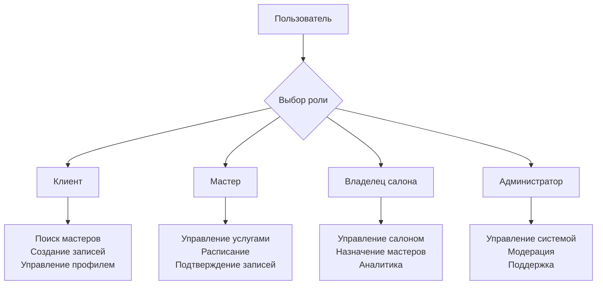
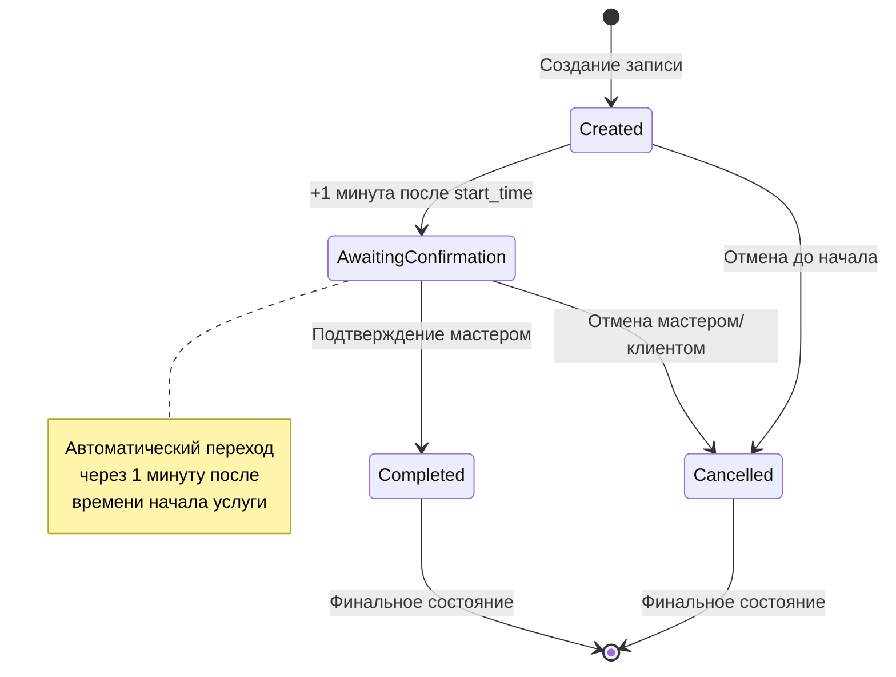

# Бизнес-логика системы DeDato

## Обзор

DeDato - это платформа для бронирования услуг красоты, которая соединяет клиентов с мастерами и салонами. Бизнес-логика системы охватывает все ключевые процессы от регистрации пользователей до финансового учета.

## Основные бизнес-процессы

### 1. Регистрация и аутентификация

#### Пользовательские роли


#### Процесс регистрации
1. **Ввод данных:** Email, телефон, пароль, полное имя
2. **Валидация:** Проверка уникальности email/телефона
3. **Создание аккаунта:** Хеширование пароля, установка роли
4. **Верификация:** Отправка SMS и email для подтверждения
5. **Активация:** Полный доступ к функциональности

### 2. Управление услугами

#### Создание услуги
```python
# Бизнес-правила для создания услуги
def create_service(master_id: int, service_data: dict) -> Service:
    # Валидация данных
    validate_service_data(service_data)
    
    # Проверка прав мастера
    if not can_master_create_service(master_id):
        raise PermissionError("Мастер не может создавать услуги")
    
    # Создание услуги
    service = Service(
        indie_master_id=master_id,
        name=service_data['name'],
        description=service_data['description'],
        duration_minutes=service_data['duration_minutes'],
        price=service_data['price'],
        service_type=service_data.get('service_type', 'volume_based')
    )
    
    return service
```

#### Валидация услуги
- **Название:** Обязательно, 3-100 символов
- **Описание:** До 500 символов
- **Длительность:** Кратна 10 минутам, 10-480 минут
- **Цена:** Положительное число, до 2 знаков после запятой
- **Тип услуги:** free, subscription, volume_based

### 3. Система бронирований

#### Жизненный цикл записи



#### Создание бронирования
```python
def create_booking(booking_data: dict) -> Booking:
    # Валидация времени (кратность 10 минутам)
    validate_booking_time(booking_data['start_time'])
    
    # Проверка доступности слота
    if not is_slot_available(
        booking_data['master_id'],
        booking_data['start_time'],
        booking_data['duration_minutes']
    ):
        raise ValidationError("Временной слот недоступен")
    
    # Проверка конфликтов
    if has_schedule_conflicts(booking_data):
        raise ValidationError("Конфликт с существующими записями")
    
    # Создание записи
    booking = Booking(
        client_id=booking_data['client_id'],
        master_id=booking_data['master_id'],
        service_id=booking_data['service_id'],
        start_time=booking_data['start_time'],
        end_time=calculate_end_time(
            booking_data['start_time'],
            booking_data['duration_minutes']
        ),
        status=BookingStatus.CREATED,
        payment_amount=booking_data['payment_amount']
    )
    
    # Отправка уведомлений
    send_booking_notifications(booking)
    
    return booking
```

### 4. Управление расписанием

#### Генерация временных слотов
```python
def generate_available_slots(
    master_id: int,
    date: date,
    service_duration: int
) -> List[datetime]:
    # Получение рабочего расписания мастера
    schedule = get_master_schedule(master_id, date)
    if not schedule:
        return []
    
    # Генерация слотов по 10 минут
    slots = []
    current_time = datetime.combine(date, schedule.start_time)
    end_time = datetime.combine(date, schedule.end_time)
    
    while current_time < end_time:
        # Проверка доступности слота
        if is_slot_available_for_service(
            master_id, current_time, service_duration
        ):
            slots.append(current_time)
        
        current_time += timedelta(minutes=10)
    
    return slots
```

#### Проверка конфликтов
```python
def check_schedule_conflicts(
    master_id: int,
    start_time: datetime,
    duration_minutes: int
) -> bool:
    end_time = start_time + timedelta(minutes=duration_minutes)
    
    # Поиск пересекающихся записей
    conflicts = db.query(Booking).filter(
        Booking.master_id == master_id,
        Booking.status.in_([
            BookingStatus.CREATED,
            BookingStatus.AWAITING_CONFIRMATION
        ]),
        Booking.start_time < end_time,
        Booking.end_time > start_time
    ).count()
    
    return conflicts > 0
```

### 5. Финансовая система

#### Расчет доходов
```python
def calculate_master_income(
    master_id: int,
    start_date: date,
    end_date: date
) -> dict:
    # Подтвержденные доходы
    confirmed_income = db.query(
        func.sum(Income.total_amount)
    ).filter(
        Income.indie_master_id == master_id,
        Income.income_date >= start_date,
        Income.income_date <= end_date
    ).scalar() or 0
    
    # Ожидаемые доходы
    expected_income = db.query(
        func.sum(Booking.payment_amount)
    ).filter(
        Booking.master_id == master_id,
        Booking.start_time >= start_date,
        Booking.start_time <= end_date,
        Booking.status.in_([
            BookingStatus.CREATED,
            BookingStatus.AWAITING_CONFIRMATION
        ])
    ).scalar() or 0
    
    # Расходы
    expenses = db.query(
        func.sum(MasterExpense.amount)
    ).filter(
        MasterExpense.master_id == master_id,
        MasterExpense.expense_date >= start_date,
        MasterExpense.expense_date <= end_date
    ).scalar() or 0
    
    return {
        'confirmed_income': confirmed_income,
        'expected_income': expected_income,
        'total_expenses': expenses,
        'net_profit': confirmed_income - expenses
    }
```

#### Подтверждение записи
```python
def confirm_booking(booking_id: int, master_id: int) -> dict:
    # Получение записи
    booking = db.query(Booking).filter(
        Booking.id == booking_id,
        Booking.master_id == master_id,
        Booking.status == BookingStatus.AWAITING_CONFIRMATION
    ).first()
    
    if not booking:
        raise NotFoundError("Запись не найдена")
    
    # Обновление статуса
    booking.status = BookingStatus.COMPLETED
    
    # Создание подтверждения
    confirmation = BookingConfirmation(
        booking_id=booking_id,
        master_id=master_id,
        confirmed_income=booking.payment_amount
    )
    db.add(confirmation)
    
    # Создание записи о доходе
    income = Income(
        booking_id=booking_id,
        indie_master_id=master_id,
        total_amount=booking.payment_amount,
        master_earnings=booking.payment_amount,
        salon_earnings=0,
        income_date=booking.start_time.date(),
        service_date=booking.start_time.date()
    )
    db.add(income)
    
    db.commit()
    
    return {
        'booking_id': booking_id,
        'confirmed_income': booking.payment_amount,
        'status': 'completed'
    }
```

### 6. Система уведомлений

#### Типы уведомлений
```python
class NotificationType(Enum):
    BOOKING_CREATED = "booking_created"
    BOOKING_CONFIRMED = "booking_confirmed"
    BOOKING_CANCELLED = "booking_cancelled"
    REMINDER_24H = "reminder_24h"
    REMINDER_1H = "reminder_1h"
    EMAIL_VERIFICATION = "email_verification"
    PHONE_VERIFICATION = "phone_verification"
```

#### Отправка уведомлений
```python
async def send_booking_notification(
    booking: Booking,
    notification_type: NotificationType
) -> bool:
    try:
        # Получение данных для уведомления
        client = get_user(booking.client_id)
        master = get_master(booking.master_id)
        
        # Формирование сообщения
        message = format_notification_message(
            booking, client, master, notification_type
        )
        
        # Отправка email
        if notification_type in [NotificationType.BOOKING_CREATED, 
                                NotificationType.BOOKING_CONFIRMED]:
            await send_email(
                to=client.email,
                subject=f"Запись {notification_type.value}",
                body=message
            )
        
        # Отправка SMS для критичных уведомлений
        if notification_type == NotificationType.BOOKING_CANCELLED:
            await send_sms(
                phone=client.phone,
                message=message
            )
        
        return True
        
    except Exception as e:
        logger.error(f"Ошибка отправки уведомления: {e}")
        return False
```

### 7. Система поиска и фильтрации

#### Поиск мастеров
```python
def search_masters(
    query: str = None,
    city: str = None,
    service_type: str = None,
    price_min: float = None,
    price_max: float = None,
    rating_min: float = None,
    limit: int = 20,
    offset: int = 0
) -> List[dict]:
    
    # Базовый запрос
    masters_query = db.query(Master).join(User)
    
    # Фильтры
    if query:
        masters_query = masters_query.filter(
            or_(
                User.full_name.ilike(f"%{query}%"),
                Master.bio.ilike(f"%{query}%")
            )
        )
    
    if city:
        masters_query = masters_query.filter(
            User.city.ilike(f"%{city}%")
        )
    
    if service_type:
        masters_query = masters_query.join(Service).filter(
            Service.name.ilike(f"%{service_type}%")
        )
    
    # Фильтр по цене через услуги
    if price_min or price_max:
        service_subquery = db.query(Service.indie_master_id)
        if price_min:
            service_subquery = service_subquery.filter(
                Service.price >= price_min
            )
        if price_max:
            service_subquery = service_subquery.filter(
                Service.price <= price_max
            )
        masters_query = masters_query.filter(
            Master.id.in_(service_subquery)
        )
    
    # Сортировка и пагинация
    masters = masters_query.order_by(
        User.full_name
    ).offset(offset).limit(limit).all()
    
    return format_masters_response(masters)
```

### 8. Система отмены записей

#### Логика освобождения слотов
```python
def cancel_booking(
    booking_id: int,
    cancelled_by_user_id: int,
    cancellation_reason: str
) -> dict:
    
    booking = db.query(Booking).filter(
        Booking.id == booking_id
    ).first()
    
    if not booking:
        raise NotFoundError("Запись не найдена")
    
    current_time = datetime.utcnow()
    
    # Обновление статуса
    booking.status = BookingStatus.CANCELLED
    booking.cancelled_by_user_id = cancelled_by_user_id
    booking.cancellation_reason = cancellation_reason
    
    # Логика освобождения слотов
    freed_slots = []
    
    if current_time < booking.start_time:
        # Отмена до начала - освобождаем все слоты
        freed_slots = generate_all_slots(
            booking.start_time,
            booking.end_time
        )
    else:
        # Отмена после начала - только будущие слоты
        next_slot = round_up_to_10_minutes(current_time)
        if next_slot < booking.end_time:
            freed_slots = generate_slots_from(
                next_slot,
                booking.end_time
            )
    
    # Уведомления
    send_cancellation_notifications(booking, freed_slots)
    
    db.commit()
    
    return {
        'booking_id': booking_id,
        'status': 'cancelled',
        'freed_slots': len(freed_slots)
    }
```

### 9. Система аналитики

#### Метрики для мастеров
```python
def get_master_analytics(
    master_id: int,
    period: str = "month"
) -> dict:
    
    start_date, end_date = get_period_dates(period)
    
    # Основные метрики
    total_bookings = db.query(Booking).filter(
        Booking.master_id == master_id,
        Booking.start_time >= start_date,
        Booking.start_time <= end_date
    ).count()
    
    completed_bookings = db.query(Booking).filter(
        Booking.master_id == master_id,
        Booking.start_time >= start_date,
        Booking.start_time <= end_date,
        Booking.status == BookingStatus.COMPLETED
    ).count()
    
    cancellation_rate = (
        db.query(Booking).filter(
            Booking.master_id == master_id,
            Booking.start_time >= start_date,
            Booking.start_time <= end_date,
            Booking.status == BookingStatus.CANCELLED
        ).count() / total_bookings * 100
        if total_bookings > 0 else 0
    )
    
    # Доходы по дням
    daily_income = db.query(
        func.date(Income.income_date).label('date'),
        func.sum(Income.total_amount).label('amount')
    ).filter(
        Income.indie_master_id == master_id,
        Income.income_date >= start_date,
        Income.income_date <= end_date
    ).group_by(
        func.date(Income.income_date)
    ).all()
    
    return {
        'total_bookings': total_bookings,
        'completed_bookings': completed_bookings,
        'cancellation_rate': cancellation_rate,
        'daily_income': [
            {'date': str(day.date), 'amount': float(day.amount)}
            for day in daily_income
        ]
    }
```

### 10. Система безопасности

#### Валидация прав доступа
```python
def check_booking_access(
    user_id: int,
    booking_id: int,
    required_permission: str
) -> bool:
    
    booking = db.query(Booking).filter(
        Booking.id == booking_id
    ).first()
    
    if not booking:
        return False
    
    user = db.query(User).filter(User.id == user_id).first()
    
    # Проверка роли и прав
    if user.role == UserRole.ADMIN:
        return True
    
    if user.role == UserRole.CLIENT and booking.client_id == user_id:
        return required_permission in ['view', 'cancel']
    
    if user.role == UserRole.MASTER and booking.master_id == user_id:
        return required_permission in ['view', 'confirm', 'cancel']
    
    return False
```

#### Валидация данных
```python
def validate_booking_data(data: dict) -> dict:
    errors = {}
    
    # Валидация времени
    if 'start_time' in data:
        try:
            start_time = datetime.fromisoformat(data['start_time'])
            if start_time.minute % 10 != 0:
                errors['start_time'] = "Время должно быть кратно 10 минутам"
            if start_time < datetime.utcnow():
                errors['start_time'] = "Время не может быть в прошлом"
        except ValueError:
            errors['start_time'] = "Некорректный формат времени"
    
    # Валидация длительности
    if 'duration_minutes' in data:
        duration = data['duration_minutes']
        if not isinstance(duration, int) or duration <= 0:
            errors['duration_minutes'] = "Длительность должна быть положительным числом"
        elif duration % 10 != 0:
            errors['duration_minutes'] = "Длительность должна быть кратна 10 минутам"
        elif duration > 480:  # 8 часов
            errors['duration_minutes'] = "Длительность не может превышать 8 часов"
    
    # Валидация цены
    if 'payment_amount' in data:
        amount = data['payment_amount']
        if not isinstance(amount, (int, float)) or amount < 0:
            errors['payment_amount'] = "Цена должна быть неотрицательным числом"
        elif amount > 100000:  # 100k рублей
            errors['payment_amount'] = "Цена не может превышать 100,000 рублей"
    
    return errors
```

## Бизнес-правила

### 1. Временные ограничения
- **Минимальная длительность услуги:** 10 минут
- **Максимальная длительность услуги:** 8 часов (480 минут)
- **Гранулярность времени:** 10 минут
- **Минимальное время бронирования:** 1 час до начала
- **Максимальное время бронирования:** 3 месяца вперед

### 2. Финансовые правила
- **Минимальная цена услуги:** 0 рублей (бесплатные услуги)
- **Максимальная цена услуги:** 100,000 рублей
- **Точность цены:** 2 знака после запятой
- **Налоговая ставка:** Настраивается администратором

### 3. Правила отмены
- **Отмена клиентом:** До 2 часов до начала - без штрафа
- **Отмена клиентом:** Менее 2 часов - возможен штраф
- **Отмена мастером:** В любое время с уведомлением клиента
- **Автоматическая отмена:** При неявке клиента через 15 минут

### 4. Правила подтверждения
- **Автоматический переход:** CREATED → AWAITING_CONFIRMATION через 1 минуту
- **Время на подтверждение:** До 24 часов после перехода
- **Автоматическая отмена:** Если не подтверждено в течение 24 часов

## Интеграции

### 1. Yandex Maps API
- **Геокодирование адресов** салонов и мастеров
- **Валидация адресов** при создании профилей
- **Расчет расстояний** для поиска ближайших мастеров

### 2. Zvonok SMS API
- **Верификация телефонов** при регистрации
- **SMS уведомления** о критичных событиях
- **Коды подтверждения** для сброса пароля

### 3. Email Service
- **Верификация email** при регистрации
- **Уведомления о записях** и изменениях
- **Маркетинговые рассылки** (опционально)

## Связанные документы

- [ADR-0003: Система статусов записей](../adr/0003-booking-status-system.md)
- [ADR-0005: Управление временными слотами](../adr/0005-slot-management.md)
- [Database Schema](database-schema.md)
- [API Design](api-design.md)


