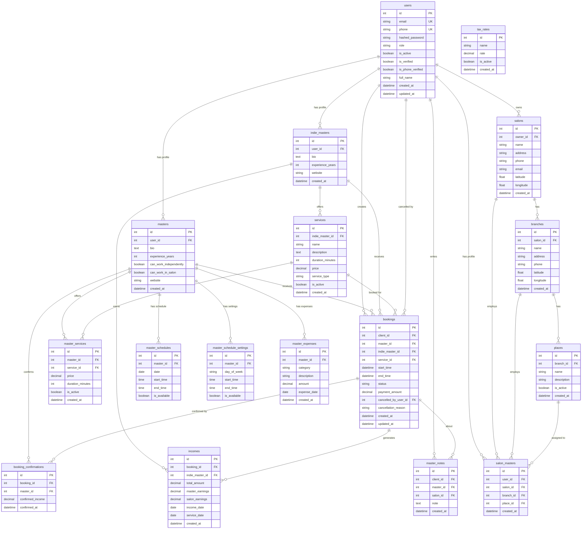

# Схема базы данных DeDato

## Обзор

База данных DeDato построена на SQLite и содержит все необходимые таблицы для функционирования платформы бронирования услуг красоты. Схема спроектирована с учетом нормализации данных, производительности и будущего масштабирования.

## ER Диаграмма



## Описание таблиц

### 👥 Пользователи и роли

#### `users` - Основная таблица пользователей
**Назначение:** Хранение информации о всех пользователях системы

| Поле | Тип | Описание |
|------|-----|----------|
| `id` | INTEGER PRIMARY KEY | Уникальный идентификатор |
| `email` | VARCHAR UNIQUE | Email адрес (уникальный) |
| `phone` | VARCHAR UNIQUE | Номер телефона (уникальный) |
| `hashed_password` | VARCHAR | Хешированный пароль (bcrypt) |
| `role` | VARCHAR | Роль: client, master, salon, admin |
| `is_active` | BOOLEAN | Активность аккаунта |
| `is_verified` | BOOLEAN | Верификация email |
| `is_phone_verified` | BOOLEAN | Верификация телефона |
| `full_name` | VARCHAR | Полное имя |
| `created_at` | DATETIME | Дата создания |
| `updated_at` | DATETIME | Дата обновления |

**Индексы:**
- `idx_users_email` на `email`
- `idx_users_phone` на `phone`
- `idx_users_role` на `role`

---

#### `masters` - Профили мастеров
**Назначение:** Дополнительная информация о мастерах

| Поле | Тип | Описание |
|------|-----|----------|
| `id` | INTEGER PRIMARY KEY | Уникальный идентификатор |
| `user_id` | INTEGER FK | Ссылка на users.id |
| `bio` | TEXT | Биография мастера |
| `experience_years` | INTEGER | Опыт работы в годах |
| `can_work_independently` | BOOLEAN | Может работать самостоятельно |
| `can_work_in_salon` | BOOLEAN | Может работать в салоне |
| `website` | VARCHAR | Веб-сайт мастера |
| `created_at` | DATETIME | Дата создания |

**Связи:**
- `user_id` → `users.id` (один к одному)

---

#### `indie_masters` - Независимые мастера
**Назначение:** Мастера, работающие самостоятельно

| Поле | Тип | Описание |
|------|-----|----------|
| `id` | INTEGER PRIMARY KEY | Уникальный идентификатор |
| `user_id` | INTEGER FK | Ссылка на users.id |
| `bio` | TEXT | Биография |
| `experience_years` | INTEGER | Опыт работы |
| `website` | VARCHAR | Веб-сайт |
| `created_at` | DATETIME | Дата создания |

---

#### `salon_masters` - Мастера в салонах
**Назначение:** Связь мастеров с салонами и рабочими местами

| Поле | Тип | Описание |
|------|-----|----------|
| `id` | INTEGER PRIMARY KEY | Уникальный идентификатор |
| `user_id` | INTEGER FK | Ссылка на users.id |
| `salon_id` | INTEGER FK | Ссылка на salons.id |
| `branch_id` | INTEGER FK | Ссылка на branches.id |
| `place_id` | INTEGER FK | Ссылка на places.id |
| `created_at` | DATETIME | Дата создания |

---

### 🏢 Салоны и филиалы

#### `salons` - Салоны красоты
**Назначение:** Информация о салонах

| Поле | Тип | Описание |
|------|-----|----------|
| `id` | INTEGER PRIMARY KEY | Уникальный идентификатор |
| `owner_id` | INTEGER FK | ID владельца (users.id) |
| `name` | VARCHAR | Название салона |
| `address` | VARCHAR | Адрес |
| `phone` | VARCHAR | Телефон |
| `email` | VARCHAR | Email |
| `latitude` | FLOAT | Широта |
| `longitude` | FLOAT | Долгота |
| `created_at` | DATETIME | Дата создания |

---

#### `branches` - Филиалы салонов
**Назначение:** Филиалы салонов

| Поле | Тип | Описание |
|------|-----|----------|
| `id` | INTEGER PRIMARY KEY | Уникальный идентификатор |
| `salon_id` | INTEGER FK | Ссылка на salons.id |
| `name` | VARCHAR | Название филиала |
| `address` | VARCHAR | Адрес |
| `phone` | VARCHAR | Телефон |
| `latitude` | FLOAT | Широта |
| `longitude` | FLOAT | Долгота |
| `created_at` | DATETIME | Дата создания |

---

#### `places` - Рабочие места
**Назначение:** Рабочие места в филиалах

| Поле | Тип | Описание |
|------|-----|----------|
| `id` | INTEGER PRIMARY KEY | Уникальный идентификатор |
| `branch_id` | INTEGER FK | Ссылка на branches.id |
| `name` | VARCHAR | Название места |
| `description` | TEXT | Описание |
| `is_active` | BOOLEAN | Активность |
| `created_at` | DATETIME | Дата создания |

---

### 🛠️ Услуги

#### `services` - Услуги независимых мастеров
**Назначение:** Услуги, предлагаемые независимыми мастерами

| Поле | Тип | Описание |
|------|-----|----------|
| `id` | INTEGER PRIMARY KEY | Уникальный идентификатор |
| `indie_master_id` | INTEGER FK | Ссылка на indie_masters.id |
| `name` | VARCHAR | Название услуги |
| `description` | TEXT | Описание |
| `duration_minutes` | INTEGER | Длительность в минутах |
| `price` | DECIMAL | Цена |
| `service_type` | VARCHAR | Тип: free, subscription, volume_based |
| `is_active` | BOOLEAN | Активность |
| `created_at` | DATETIME | Дата создания |

---

#### `master_services` - Услуги мастеров в салонах
**Назначение:** Услуги, предлагаемые мастерами в салонах

| Поле | Тип | Описание |
|------|-----|----------|
| `id` | INTEGER PRIMARY KEY | Уникальный идентификатор |
| `master_id` | INTEGER FK | Ссылка на masters.id |
| `service_id` | INTEGER FK | Ссылка на services.id |
| `price` | DECIMAL | Цена мастера |
| `duration_minutes` | INTEGER | Длительность |
| `is_active` | BOOLEAN | Активность |
| `created_at` | DATETIME | Дата создания |

---

### 📅 Бронирования

#### `bookings` - Записи на услуги
**Назначение:** Основная таблица бронирований

| Поле | Тип | Описание |
|------|-----|----------|
| `id` | INTEGER PRIMARY KEY | Уникальный идентификатор |
| `client_id` | INTEGER FK | ID клиента (users.id) |
| `master_id` | INTEGER FK | ID мастера (masters.id) |
| `indie_master_id` | INTEGER FK | ID независимого мастера |
| `service_id` | INTEGER FK | ID услуги |
| `start_time` | DATETIME | Время начала |
| `end_time` | DATETIME | Время окончания |
| `status` | VARCHAR | Статус: created, awaiting_confirmation, completed, cancelled |
| `payment_amount` | DECIMAL | Сумма оплаты |
| `cancelled_by_user_id` | INTEGER FK | Кто отменил |
| `cancellation_reason` | VARCHAR | Причина отмены |
| `created_at` | DATETIME | Дата создания |
| `updated_at` | DATETIME | Дата обновления |

**Индексы:**
- `idx_bookings_client_id` на `client_id`
- `idx_bookings_master_id` на `master_id`
- `idx_bookings_start_time` на `start_time`
- `idx_bookings_status` на `status`

---

#### `booking_confirmations` - Подтверждения записей
**Назначение:** Подтверждения записей мастерами

| Поле | Тип | Описание |
|------|-----|----------|
| `id` | INTEGER PRIMARY KEY | Уникальный идентификатор |
| `booking_id` | INTEGER FK | Ссылка на bookings.id |
| `master_id` | INTEGER FK | ID мастера |
| `confirmed_income` | DECIMAL | Подтвержденный доход |
| `confirmed_at` | DATETIME | Время подтверждения |

---

### ⏰ Расписания

#### `master_schedules` - Расписания мастеров
**Назначение:** Рабочие расписания мастеров по дням

| Поле | Тип | Описание |
|------|-----|----------|
| `id` | INTEGER PRIMARY KEY | Уникальный идентификатор |
| `master_id` | INTEGER FK | Ссылка на masters.id |
| `date` | DATE | Дата |
| `start_time` | TIME | Время начала |
| `end_time` | TIME | Время окончания |
| `is_available` | BOOLEAN | Доступность |

**Индексы:**
- `idx_master_schedules_master_date` на `master_id, date`

---

#### `master_schedule_settings` - Настройки расписания
**Назначение:** Шаблоны расписания по дням недели

| Поле | Тип | Описание |
|------|-----|----------|
| `id` | INTEGER PRIMARY KEY | Уникальный идентификатор |
| `master_id` | INTEGER FK | Ссылка на masters.id |
| `day_of_week` | VARCHAR | День недели |
| `start_time` | TIME | Время начала |
| `end_time` | TIME | Время окончания |
| `is_available` | BOOLEAN | Доступность |

---

### 💰 Финансы

#### `incomes` - Доходы
**Назначение:** Учет доходов от услуг

| Поле | Тип | Описание |
|------|-----|----------|
| `id` | INTEGER PRIMARY KEY | Уникальный идентификатор |
| `booking_id` | INTEGER FK | Ссылка на bookings.id |
| `indie_master_id` | INTEGER FK | ID независимого мастера |
| `total_amount` | DECIMAL | Общая сумма |
| `master_earnings` | DECIMAL | Заработок мастера |
| `salon_earnings` | DECIMAL | Заработок салона |
| `income_date` | DATE | Дата дохода |
| `service_date` | DATE | Дата услуги |
| `created_at` | DATETIME | Дата создания |

---

#### `master_expenses` - Расходы мастеров
**Назначение:** Учет расходов мастеров

| Поле | Тип | Описание |
|------|-----|----------|
| `id` | INTEGER PRIMARY KEY | Уникальный идентификатор |
| `master_id` | INTEGER FK | Ссылка на masters.id |
| `category` | VARCHAR | Категория расхода |
| `description` | TEXT | Описание |
| `amount` | DECIMAL | Сумма |
| `expense_date` | DATE | Дата расхода |
| `created_at` | DATETIME | Дата создания |

---

#### `tax_rates` - Налоговые ставки
**Назначение:** Налоговые ставки для расчетов

| Поле | Тип | Описание |
|------|-----|----------|
| `id` | INTEGER PRIMARY KEY | Уникальный идентификатор |
| `name` | VARCHAR | Название налога |
| `rate` | DECIMAL | Ставка (в процентах) |
| `is_active` | BOOLEAN | Активность |
| `created_at` | DATETIME | Дата создания |

---

### 📝 Заметки

#### `master_notes` - Заметки о мастерах
**Назначение:** Заметки клиентов о мастерах и салонах

| Поле | Тип | Описание |
|------|-----|----------|
| `id` | INTEGER PRIMARY KEY | Уникальный идентификатор |
| `client_id` | INTEGER FK | ID клиента |
| `master_id` | INTEGER FK | ID мастера |
| `salon_id` | INTEGER FK | ID салона |
| `note` | TEXT | Текст заметки |
| `created_at` | DATETIME | Дата создания |

---

## Ключевые индексы

### Производительность запросов
```sql
-- Часто используемые запросы
CREATE INDEX idx_bookings_master_date ON bookings(master_id, start_time);
CREATE INDEX idx_bookings_client_date ON bookings(client_id, start_time);
CREATE INDEX idx_bookings_status ON bookings(status);
CREATE INDEX idx_master_schedules_master_date ON master_schedules(master_id, date);
CREATE INDEX idx_incomes_master_date ON incomes(indie_master_id, income_date);
```

### Уникальность
```sql
-- Уникальные ограничения
CREATE UNIQUE INDEX idx_users_email ON users(email);
CREATE UNIQUE INDEX idx_users_phone ON users(phone);
CREATE UNIQUE INDEX idx_master_schedule_unique ON master_schedules(master_id, date, start_time);
```

## Ограничения целостности

### Foreign Key Constraints
```sql
-- Основные внешние ключи
ALTER TABLE masters ADD CONSTRAINT fk_masters_user_id 
    FOREIGN KEY (user_id) REFERENCES users(id);

ALTER TABLE bookings ADD CONSTRAINT fk_bookings_client_id 
    FOREIGN KEY (client_id) REFERENCES users(id);

ALTER TABLE bookings ADD CONSTRAINT fk_bookings_master_id 
    FOREIGN KEY (master_id) REFERENCES masters(id);

ALTER TABLE incomes ADD CONSTRAINT fk_incomes_booking_id 
    FOREIGN KEY (booking_id) REFERENCES bookings(id);
```

### Check Constraints
```sql
-- Проверка значений
ALTER TABLE bookings ADD CONSTRAINT chk_booking_times 
    CHECK (end_time > start_time);

ALTER TABLE bookings ADD CONSTRAINT chk_booking_status 
    CHECK (status IN ('created', 'awaiting_confirmation', 'completed', 'cancelled'));

ALTER TABLE users ADD CONSTRAINT chk_user_role 
    CHECK (role IN ('client', 'master', 'salon', 'admin', 'indie', 'moderator'));
```

## Миграции

### Alembic
Система использует Alembic для управления миграциями базы данных:

```bash
# Создание новой миграции
alembic revision --autogenerate -m "Add new table"

# Применение миграций
alembic upgrade head

# Откат миграции
alembic downgrade -1
```

### Примеры миграций
```python
# Добавление нового поля
def upgrade():
    op.add_column('bookings', sa.Column('cancellation_reason', sa.String(255)))

# Создание индекса
def upgrade():
    op.create_index('idx_bookings_status', 'bookings', ['status'])

# Обновление данных
def upgrade():
    op.execute("UPDATE bookings SET status = 'created' WHERE status = 'pending'")
```

## Планы масштабирования

### Phase 1: PostgreSQL Migration
- Миграция с SQLite на PostgreSQL
- Использование advanced features (JSONB, Full-text search)
- Партиционирование больших таблиц

### Phase 2: Read Replicas
- Настройка read replicas для отчетов
- Разделение read/write операций
- Кэширование часто запрашиваемых данных

### Phase 3: Sharding
- Горизонтальное разделение по регионам
- Sharding по master_id для bookings
- Distributed transactions

## Мониторинг производительности

### Ключевые метрики
- **Query performance:** Время выполнения запросов
- **Index usage:** Использование индексов
- **Table sizes:** Размеры таблиц
- **Connection pool:** Использование соединений

### Оптимизация запросов
```sql
-- Анализ медленных запросов
EXPLAIN QUERY PLAN SELECT * FROM bookings 
WHERE master_id = ? AND start_time >= ? AND start_time < ?;

-- Статистика использования индексов
SELECT name, sql FROM sqlite_master WHERE type = 'index';
```

## Связанные документы

- [ADR-0002: Выбор базы данных](../adr/0002-database-choice.md)
- [ADR-0003: Система статусов записей](../adr/0003-booking-status-system.md)
- [API Design](api-design.md)
- [Business Logic](business-logic.md)


