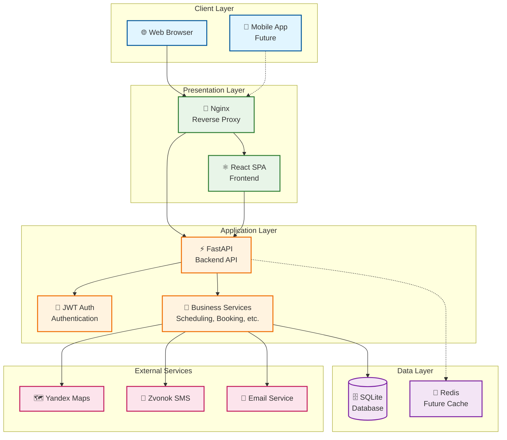
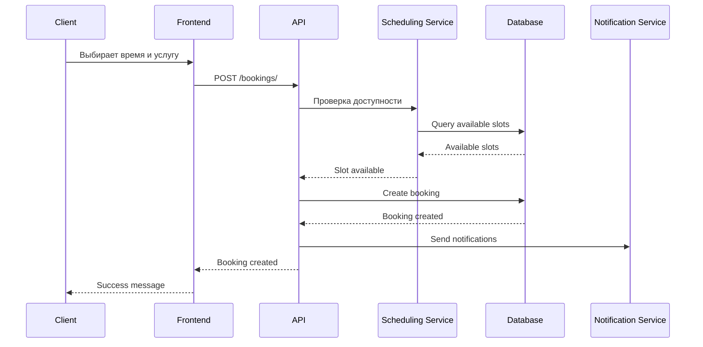
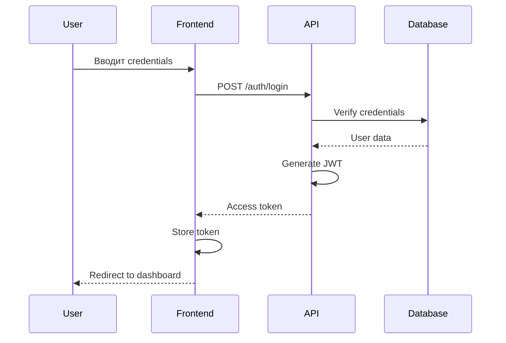
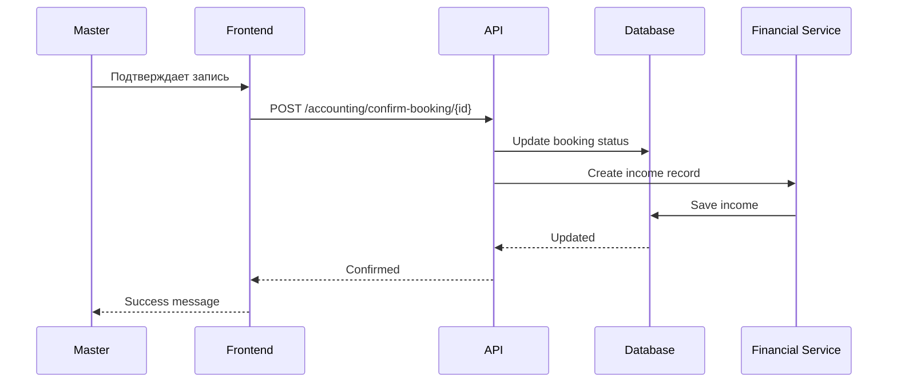

# Архитектурный обзор DeDato

## Введение

DeDato - это платформа для бронирования услуг красоты, которая соединяет клиентов с мастерами и салонами. Система построена на современном технологическом стеке с акцентом на производительность, масштабируемость и удобство использования.

## Принципы архитектуры

### 1. Модульность
- Четкое разделение ответственности между компонентами
- Слабая связанность, высокая сплоченность
- Возможность независимого развития модулей

### 2. Масштабируемость
- Stateless backend для горизонтального масштабирования
- Кэширование на всех уровнях
- Готовность к микросервисной архитектуре

### 3. Безопасность
- JWT аутентификация
- Валидация данных на всех уровнях
- Защита от основных уязвимостей (XSS, CSRF, SQL Injection)

### 4. Производительность
- Асинхронная обработка запросов
- Оптимизированные SQL запросы
- CDN для статических ресурсов

### 5. Надежность
- ACID транзакции для критичных операций
- Graceful error handling
- Comprehensive logging

## Высокоуровневая архитектура



## Технологический стек

### Frontend
- **React 18** - UI библиотека с hooks
- **Vite 6** - Быстрый build tool и dev server
- **TailwindCSS** - Utility-first CSS framework
- **React Router** - Клиентская маршрутизация
- **Axios** - HTTP клиент для API

### Backend
- **FastAPI 0.109.2** - Современный Python web framework
- **SQLAlchemy 2.0.25** - ORM для работы с БД
- **Pydantic 2.6.1** - Валидация данных
- **Alembic** - Миграции базы данных
- **python-jose** - JWT токены

### Database
- **SQLite 3.x** - Встроенная реляционная БД
- **Планы миграции на PostgreSQL** при росте нагрузки

### Infrastructure
- **Docker & Docker Compose** - Контейнеризация
- **Nginx** - Reverse proxy и статические файлы
- **Linux** - Операционная система

## Архитектурные паттерны

### 1. Layered Architecture

```
┌─────────────────────────────────────┐
│           Presentation Layer        │  ← React SPA, Nginx
├─────────────────────────────────────┤
│           Application Layer         │  ← FastAPI, Business Logic
├─────────────────────────────────────┤
│             Data Layer              │  ← SQLAlchemy, SQLite
└─────────────────────────────────────┘
```

**Преимущества:**
- Четкое разделение ответственности
- Легкость тестирования
- Независимость слоев

### 2. Repository Pattern

```python
# Пример использования Repository pattern
class BookingRepository:
    def create(self, booking_data: dict) -> Booking:
        # Создание бронирования
    
    def find_by_master(self, master_id: int) -> List[Booking]:
        # Поиск записей мастера
    
    def update_status(self, booking_id: int, status: str) -> Booking:
        # Обновление статуса
```

### 3. Service Layer Pattern

```python
# Пример Service layer
class BookingService:
    def __init__(self, booking_repo: BookingRepository, 
                 scheduling_service: SchedulingService):
        self.booking_repo = booking_repo
        self.scheduling_service = scheduling_service
    
    def create_booking(self, booking_data: dict) -> Booking:
        # Бизнес-логика создания бронирования
        if not self.scheduling_service.is_slot_available(...):
            raise ValidationError("Slot not available")
        
        return self.booking_repo.create(booking_data)
```

### 4. Dependency Injection

```python
# FastAPI автоматически инжектирует зависимости
@router.post("/bookings/")
async def create_booking(
    booking_data: BookingCreate,
    db: Session = Depends(get_db),  # DI
    current_user: User = Depends(get_current_user)  # DI
):
    # Логика создания бронирования
```

## Ключевые компоненты

### 1. Система аутентификации

**JWT-based аутентификация:**
- Access tokens (30 минут)
- Refresh tokens (7 дней)
- Ролевая авторизация (CLIENT, MASTER, SALON, ADMIN)

**Безопасность:**
- Bcrypt для хеширования паролей
- HTTPS для всех соединений
- CORS настроен для frontend домена

### 2. Система бронирований

**Жизненный цикл записи:**
```
CREATED → AWAITING_CONFIRMATION → COMPLETED
    ↓
CANCELLED
```

**Ключевые особенности:**
- 10-минутная гранулярность слотов
- Автоматические переходы статусов
- Проверка конфликтов расписания
- Финансовая отчетность

### 3. Система расписаний

**Генерация слотов:**
- Рабочие часы мастеров
- Доступность услуг
- Проверка конфликтов
- Освобождение при отмене

### 4. Финансовая система

**Учет доходов и расходов:**
- Подтвержденные доходы
- Ожидаемые доходы
- Расходы мастеров
- Налоговые расчеты

## Потоки данных

### 1. Создание бронирования



### 2. Аутентификация



### 3. Подтверждение записи



## Масштабирование

### Текущее состояние (MVP)
- Single server deployment
- SQLite database
- ~100 одновременных пользователей
- Простое развертывание

### Phase 1: Database Migration
- Миграция на PostgreSQL
- Load balancer
- 2+ app servers
- ~1,000 пользователей

### Phase 2: Caching & CDN
- Redis для кэширования
- CDN для статических файлов
- Database read replicas
- ~10,000 пользователей

### Phase 3: Microservices
- Booking Service (отдельный)
- User Service (отдельный)
- Notification Service (отдельный)
- Event-driven architecture
- ~100,000+ пользователей

## Мониторинг и наблюдаемость

### Логирование
- **Structured JSON logs** для всех компонентов
- **Request/Response logging** для API
- **Error tracking** с контекстом
- **Performance metrics** (response time, throughput)

### Метрики
- **Business metrics:** количество бронирований, доходы
- **Technical metrics:** response time, error rate, CPU/memory
- **User metrics:** активные пользователи, conversion rate

### Health Checks
- **API health:** `/health` endpoint
- **Database connectivity:** проверка соединения
- **External services:** доступность Yandex, Zvonok, Email

## Безопасность

### Аутентификация и авторизация
- JWT токены с коротким временем жизни
- Refresh token rotation
- Ролевая авторизация на уровне API
- Защита от brute force атак

### Защита данных
- HTTPS для всех соединений
- Валидация и санитизация всех входных данных
- Защита от SQL injection через ORM
- CORS настроен для frontend домена

### Мониторинг безопасности
- Логирование всех аутентификационных попыток
- Мониторинг подозрительной активности
- Регулярные security audits

## Производительность

### Backend оптимизации
- Асинхронная обработка запросов (async/await)
- Connection pooling для БД
- Кэширование часто запрашиваемых данных
- Оптимизированные SQL запросы

### Frontend оптимизации
- Code splitting по маршрутам
- Lazy loading компонентов
- Image optimization
- Bundle size optimization

### Database оптимизации
- Индексы на часто запрашиваемые поля
- Query optimization
- Connection pooling
- Планируемое партиционирование больших таблиц

## Тестирование

### Unit Tests
- Backend: pytest для Python кода
- Frontend: Jest + React Testing Library
- Покрытие кода >80%

### Integration Tests
- API endpoint тестирование
- Database integration тесты
- External service mocking

### E2E Tests
- Playwright для критичных пользовательских сценариев
- Автоматизированное тестирование в CI/CD

## Развертывание

### Development
```bash
# Frontend
cd frontend && npm run dev

# Backend
cd backend && uvicorn main:app --reload
```

### Production
```bash
# Docker Compose
docker-compose -f docker-compose.prod.yml up -d
```

### CI/CD Pipeline
1. **Code push** → GitHub
2. **Automated tests** → pytest, Jest
3. **Build** → Docker images
4. **Deploy** → Production server
5. **Health check** → Verify deployment

## Связанные документы

- [ADR-0001: Выбор технологического стека](../adr/0001-tech-stack.md)
- [ADR-0002: Выбор базы данных](../adr/0002-database-choice.md)
- [ADR-0003: Система статусов записей](../adr/0003-booking-status-system.md)
- [C4 Model: System Context](../c4/01-context.md)
- [Database Schema](database-schema.md)
- [API Design](api-design.md)
- [Frontend Architecture](frontend-architecture.md)


