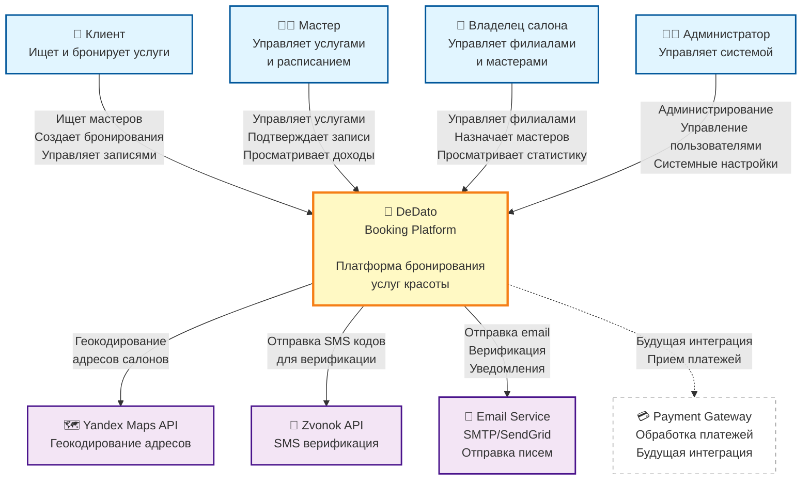

# C4 Model - Level 1: System Context

## Обзор

System Context диаграмма показывает DeDato в контексте внешних акторов и систем. Это самый высокий уровень абстракции, который демонстрирует, кто использует систему и с какими внешними системами она интегрируется.

## Диаграмма



## Описание акторов

### 👤 Клиент (Client)
**Роль:** Конечный потребитель услуг

**Основные задачи:**
- Поиск мастеров и салонов по услугам/геолокации
- Просмотр доступных временных слотов
- Создание бронирований
- Управление своими записями
- Просмотр истории посещений
- Добавление заметок о мастерах/салонах

**Доступ:** Web браузер (React SPA)

---

### 👨‍💼 Мастер (Master)
**Роль:** Специалист, оказывающий услуги

**Основные задачи:**
- Управление списком услуг и ценами
- Создание рабочего расписания
- Просмотр и подтверждение записей
- Управление финансами (доходы, расходы)
- Просмотр статистики
- Подтверждение оказанных услуг

**Доступ:** Web браузер (React SPA)

**Типы мастеров:**
- Независимый мастер (indie master)
- Мастер, работающий в салоне (salon master)

---

### 🏢 Владелец салона (Salon Owner)
**Роль:** Управляющий салоном красоты

**Основные задачи:**
- Управление филиалами салона
- Добавление и управление мастерами
- Управление рабочими местами
- Назначение мастеров на места
- Просмотр общей статистики
- Управление расписанием салона

**Доступ:** Web браузер (React SPA)

---

### 👨‍💻 Администратор (Admin)
**Роль:** Системный администратор платформы

**Основные задачи:**
- Управление пользователями
- Модерация контента
- Системные настройки
- Мониторинг работы системы
- Разрешение конфликтов
- Доступ к аналитике

**Доступ:** Web браузер (React SPA) + Backend console

---

## Описание внешних систем

### 🗺️ Yandex Maps API
**Назначение:** Геокодирование и работа с адресами

**Интеграция:**
- Преобразование адресов в координаты
- Валидация адресов салонов
- Отображение на карте (будущая фича)

**Протокол:** HTTPS REST API

**Документация:** [Yandex Geocoder API](https://yandex.ru/dev/maps/geocoder/)

---

### 📱 Zvonok API
**Назначение:** SMS верификация телефонов

**Интеграция:**
- Отправка SMS с кодом верификации
- Подтверждение телефонных номеров

**Протокол:** HTTPS REST API

**Использование:** При регистрации и изменении телефона

---

### 📧 Email Service
**Назначение:** Отправка email сообщений

**Интеграция:**
- Верификация email при регистрации
- Уведомления о бронированиях
- Напоминания о записях
- Сброс пароля
- Маркетинговые рассылки (опция)

**Протокол:** SMTP / SendGrid API

**Поддерживаемые провайдеры:**
- SMTP (Gmail, Yandex)
- SendGrid (будущая интеграция)

---

### 💳 Payment Gateway (Будущая интеграция)
**Назначение:** Обработка онлайн-платежей

**Планируемая интеграция:**
- Предоплата услуг
- Онлайн-оплата после оказания услуги
- Возврат средств при отмене

**Рассматриваемые провайдеры:**
- ЮKassa
- Stripe
- PayPal

**Статус:** 🔄 Запланировано

---

## Основные потоки данных

### 1. Создание бронирования (Client → DeDato → Master)

```
Клиент → DeDato: Запрос доступных слотов
DeDato → Клиент: Список доступных времен
Клиент → DeDato: Создание бронирования
DeDato → Email: Подтверждение клиенту
DeDato → Email: Уведомление мастеру
Мастер → DeDato: Просмотр новой записи
```

### 2. Регистрация пользователя (Client/Master → DeDato → Zvonok/Email)

```
Пользователь → DeDato: Данные регистрации
DeDato → Zvonok: Отправка SMS кода
Zvonok → Пользователь: SMS с кодом
Пользователь → DeDato: Подтверждение кода
DeDato → Email: Письмо верификации
DeDato → Пользователь: Доступ к системе
```

### 3. Добавление салона (Salon → DeDato → Yandex)

```
Владелец → DeDato: Адрес салона
DeDato → Yandex Maps: Геокодирование
Yandex Maps → DeDato: Координаты
DeDato → Владелец: Подтверждение на карте
```

---

## Границы системы

### Что внутри DeDato:
- ✅ Управление пользователями и ролями
- ✅ Система бронирований
- ✅ Управление услугами и ценами
- ✅ Финансовый учет (доходы, расходы)
- ✅ Расписания мастеров и салонов
- ✅ Статистика и аналитика

### Что снаружи DeDato:
- ❌ SMS-доставка (Zvonok API)
- ❌ Email-доставка (SMTP/SendGrid)
- ❌ Геокодирование (Yandex Maps)
- ❌ Платежи (Payment Gateway) - будущее
- ❌ Календарные интеграции (Google Calendar, iCal) - будущее

---

## Технические детали

### Протоколы взаимодействия

| Связь | Протокол | Формат данных |
|-------|----------|---------------|
| Клиент ↔ DeDato | HTTPS | JSON (REST) |
| Мастер ↔ DeDato | HTTPS | JSON (REST) |
| Салон ↔ DeDato | HTTPS | JSON (REST) |
| Админ ↔ DeDato | HTTPS | JSON (REST) |
| DeDato → Yandex | HTTPS | JSON |
| DeDato → Zvonok | HTTPS | JSON |
| DeDato → Email | SMTP / HTTPS | MIME / JSON |

### Аутентификация

- **Пользователи → DeDato:** JWT (Bearer tokens)
- **DeDato → Yandex:** API Key
- **DeDato → Zvonok:** API Key
- **DeDato → Email:** SMTP credentials / API Key

### Безопасность

- 🔒 HTTPS для всех соединений
- 🔑 JWT для аутентификации
- 🛡️ CORS настроен для frontend домена
- 🔐 API keys в environment variables
- 🚫 Rate limiting на критичные endpoints

---

## Масштабирование

### Текущая конфигурация (MVP)
- Single server deployment
- SQLite database
- ~100 одновременных пользователей

### Планы масштабирования
1. **Phase 1 (1K users):**
   - Миграция на PostgreSQL
   - Load balancer
   - CDN для статики

2. **Phase 2 (10K users):**
   - Database replication
   - Redis для кэширования
   - Microservices (booking service отдельно)

3. **Phase 3 (100K+ users):**
   - Kubernetes deployment
   - Multi-region setup
   - Event-driven architecture

---

## Связанные документы

- [ADR-0001: Выбор технологического стека](../adr/0001-tech-stack.md)
- [ADR-0004: Аутентификация и авторизация](../adr/0004-authentication-jwt.md)
- [C4 Level 2: Container диаграмма](02-container.md)


