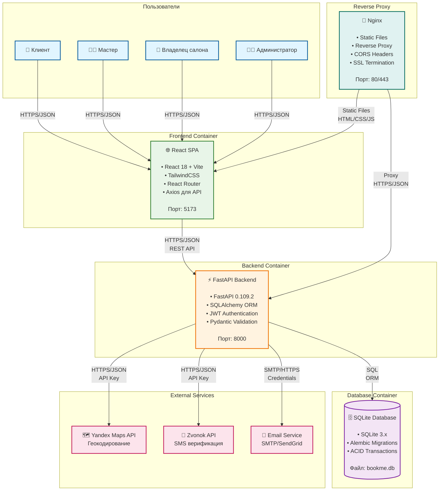

# C4 Model - Level 2: Container

## Обзор

Container диаграмма показывает высокоуровневую архитектуру DeDato и показывает, как ответственности распределены между контейнерами, как контейнеры взаимодействуют друг с другом и какие технологии используются.

## Диаграмма



## Описание контейнеров

### 🌐 React SPA (Single Page Application)

**Технологии:**
- React 18.2.0
- Vite 6.3.5 (build tool)
- TailwindCSS 3.x (styling)
- React Router 6.x (routing)
- Axios (HTTP client)

**Ответственности:**
- Пользовательский интерфейс
- Маршрутизация между страницами
- Управление состоянием (React hooks)
- Валидация форм
- Отображение данных от API

**Порт:** 5173 (development), 80/443 (production)

**Взаимодействие:**
- Получает данные от FastAPI через REST API
- Отображает статические файлы через Nginx
- Аутентификация через JWT токены

---

### ⚡ FastAPI Backend

**Технологии:**
- FastAPI 0.109.2
- Python 3.9+
- SQLAlchemy 2.0.25 (ORM)
- Pydantic 2.6.1 (validation)
- python-jose (JWT)
- Alembic (migrations)

**Ответственности:**
- REST API endpoints
- Бизнес-логика
- Аутентификация и авторизация
- Валидация данных
- Интеграция с внешними сервисами
- Управление базой данных

**Порт:** 8000

**Основные модули:**
- `routers/` - API endpoints по доменам
- `models/` - SQLAlchemy модели
- `schemas/` - Pydantic схемы
- `services/` - Бизнес-логика
- `utils/` - Вспомогательные функции

**Взаимодействие:**
- Обслуживает API запросы от React SPA
- Читает/записывает данные в SQLite
- Интегрируется с внешними API

---

### 🗄️ SQLite Database

**Технологии:**
- SQLite 3.x
- SQLAlchemy ORM
- Alembic migrations

**Ответственности:**
- Хранение данных приложения
- ACID транзакции
- Интегрированность данных

**Файл:** `backend/bookme.db`

**Основные таблицы:**
- `users` - Пользователи системы
- `bookings` - Бронирования
- `masters` - Профили мастеров
- `services` - Услуги
- `incomes` - Доходы
- `master_expenses` - Расходы

**Взаимодействие:**
- Принимает SQL запросы от FastAPI
- Обеспечивает целостность данных
- Поддерживает миграции через Alembic

---

### 🔄 Nginx

**Технологии:**
- Nginx 1.x
- SSL/TLS termination

**Ответственности:**
- Обслуживание статических файлов (HTML, CSS, JS)
- Reverse proxy для API запросов
- CORS headers
- SSL termination (в production)

**Порты:** 80 (HTTP), 443 (HTTPS)

**Конфигурация:**
```nginx
server {
    listen 80;
    server_name dedato.com;
    
    # Статические файлы
    location / {
        root /var/www/html;
        try_files $uri $uri/ /index.html;
    }
    
    # API proxy
    location /api/ {
        proxy_pass http://backend:8000;
        proxy_set_header Host $host;
        proxy_set_header X-Real-IP $remote_addr;
    }
}
```

---

## Потоки данных

### 1. Пользовательский запрос

```
Пользователь → Nginx → React SPA → FastAPI → SQLite
                ↓
            Статические файлы
```

**Детализация:**
1. Пользователь открывает браузер
2. Nginx отдает статические файлы (HTML, CSS, JS)
3. React SPA загружается и делает API запросы
4. FastAPI обрабатывает запросы и обращается к БД
5. Данные возвращаются через цепочку обратно

### 2. Аутентификация

```
React SPA → FastAPI → SQLite
    ↓
JWT Token (localStorage)
```

**Детализация:**
1. Пользователь вводит credentials
2. FastAPI проверяет в БД и генерирует JWT
3. Токен сохраняется в localStorage
4. Последующие запросы включают токен в заголовке

### 3. Интеграция с внешними сервисами

```
FastAPI → Yandex Maps API
FastAPI → Zvonok API
FastAPI → Email Service
```

**Детализация:**
1. Пользователь добавляет адрес салона
2. FastAPI отправляет запрос в Yandex Maps
3. Полученные координаты сохраняются в БД
4. Аналогично для SMS и Email

---

## Технические детали

### Протоколы и порты

| Контейнер | Порт | Протокол | Назначение |
|-----------|------|----------|------------|
| React SPA | 5173 | HTTP | Development server |
| FastAPI | 8000 | HTTP | API server |
| SQLite | - | SQL | Database file |
| Nginx | 80/443 | HTTP/HTTPS | Reverse proxy |

### Аутентификация

- **JWT токены** в Authorization header
- **Access token:** 30 минут
- **Refresh token:** 7 дней
- **Хранение:** localStorage (frontend)

### CORS настройки

```python
# FastAPI CORS
app.add_middleware(
    CORSMiddleware,
    allow_origins=["http://localhost:5173", "https://dedato.com"],
    allow_credentials=True,
    allow_methods=["*"],
    allow_headers=["*"],
)
```

### Безопасность

- 🔒 HTTPS в production
- 🛡️ CORS настроен для frontend домена
- 🔑 JWT для аутентификации
- 🚫 Rate limiting на API endpoints
- 🔐 Environment variables для секретов

---

## Масштабирование

### Текущая архитектура (MVP)
- Single server deployment
- SQLite database
- ~100 одновременных пользователей

### Планы масштабирования

#### Phase 1: Database Migration
```
SQLite → PostgreSQL
Single server → Load balancer + 2 app servers
```

#### Phase 2: Caching Layer
```
FastAPI → Redis Cache → PostgreSQL
CDN для статических файлов
```

#### Phase 3: Microservices
```
Booking Service (отдельный)
User Service (отдельный)
Notification Service (отдельный)
```

---

## Мониторинг и логирование

### Логирование
- **FastAPI:** Structured JSON logs
- **Nginx:** Access и error logs
- **React:** Console logs (development)

### Метрики
- Response time API endpoints
- Database query performance
- Error rates по endpoint'ам
- User activity metrics

### Health checks
- `/health` endpoint для FastAPI
- Database connectivity check
- External services availability

---

## Развертывание

### Development
```bash
# Frontend
cd frontend && npm run dev

# Backend
cd backend && uvicorn main:app --reload

# Database
# SQLite файл создается автоматически
```

### Production
```bash
# Docker Compose
docker-compose -f docker-compose.prod.yml up -d

# Или ручное развертывание
# 1. Build frontend
# 2. Deploy static files to Nginx
# 3. Run FastAPI with Gunicorn
# 4. Configure Nginx reverse proxy
```

---

## Связанные документы

- [C4 Level 1: System Context](01-context.md)
- [C4 Level 3: Backend Components](03-component-backend.md)
- [C4 Level 4: Frontend Components](04-component-frontend.md)
- [ADR-0001: Выбор технологического стека](../adr/0001-tech-stack.md)
- [ADR-0002: Выбор базы данных](../adr/0002-database-choice.md)


