# C4 Model - Level 3: Backend Components

## Обзор

Component диаграмма показывает внутреннюю структуру FastAPI backend контейнера, включая основные компоненты, их ответственности и взаимодействие между ними.

## Диаграмма

```mermaid
graph TB
    %% Внешние системы
    subgraph "External Systems"
        Frontend[🌐 React Frontend]
        Yandex[🗺️ Yandex Maps API]
        Zvonok[📱 Zvonok API]
        Email[📧 Email Service]
    end
    
    %% FastAPI Application
    subgraph "FastAPI Backend Container"
        %% API Layer
        subgraph "API Layer"
            AuthRouter[🔐 Auth Router<br/>/auth/*<br/><br/>• Login/Register<br/>• JWT tokens<br/>• Password reset<br/>• Email verification]
            
            BookingRouter[📅 Booking Router<br/>/bookings/*<br/><br/>• Create booking<br/>• Get bookings<br/>• Update booking<br/>• Cancel booking]
            
            MasterRouter[👨‍💼 Master Router<br/>/master/*<br/><br/>• Master dashboard<br/>• Services management<br/>• Schedule management<br/>• Past appointments]
            
            SalonRouter[🏢 Salon Router<br/>/salon/*<br/><br/>• Salon management<br/>• Branch management<br/>• Master assignment<br/>• Places management]
            
            ClientRouter[👤 Client Router<br/>/client/*<br/><br/>• Client dashboard<br/>• Booking history<br/>• Notes management<br/>• Profile settings]
            
            AccountingRouter[💰 Accounting Router<br/>/accounting/*<br/><br/>• Financial reports<br/>• Income tracking<br/>• Expense management<br/>• Booking confirmations]
            
            AdminRouter[⚙️ Admin Router<br/>/admin/*<br/><br/>• User management<br/>• System settings<br/>• Analytics<br/>• Moderation]
        end
        
        %% Service Layer
        subgraph "Service Layer"
            AuthService[🔑 Auth Service<br/><br/>• JWT generation<br/>• Password hashing<br/>• Token validation<br/>• User verification]
            
            BookingService[📋 Booking Service<br/><br/>• Slot validation<br/>• Conflict detection<br/>• Status management<br/>• Notification triggers]
            
            SchedulingService[⏰ Scheduling Service<br/><br/>• Time slot generation<br/>• Availability check<br/>• Schedule conflicts<br/>• Working hours]
            
            NotificationService[📢 Notification Service<br/><br/>• Email sending<br/>• SMS sending<br/>• Push notifications<br/>• Template management]
            
            VerificationService[✅ Verification Service<br/><br/>• Email verification<br/>• Phone verification<br/>• Code generation<br/>• Expiration handling]
            
            FinancialService[💵 Financial Service<br/><br/>• Income calculation<br/>• Expense tracking<br/>• Tax calculations<br/>• Report generation]
        end
        
        %% Data Layer
        subgraph "Data Layer"
            UserModel[👥 User Model<br/><br/>• User data<br/>• Authentication<br/>• Roles & permissions<br/>• Profile info]
            
            BookingModel[📅 Booking Model<br/><br/>• Booking data<br/>• Status tracking<br/>• Time slots<br/>• Client info]
            
            MasterModel[👨‍💼 Master Model<br/><br/>• Master profiles<br/>• Services<br/>• Schedules<br/>• Experience]
            
            SalonModel[🏢 Salon Model<br/><br/>• Salon data<br/>• Branches<br/>• Places<br/>• Master assignments]
            
            FinancialModel[💰 Financial Model<br/><br/>• Incomes<br/>• Expenses<br/>• Tax rates<br/>• Reports]
        end
        
        %% Database
        Database[(🗄️ SQLite Database<br/><br/>• ACID transactions<br/>• Data persistence<br/>• Query optimization<br/>• Migrations)]
        
        %% Utils
        subgraph "Utilities"
            BookingStatus[📊 Booking Status Utils<br/><br/>• Status transitions<br/>• Time-based logic<br/>• Effective status<br/>• Validation]
            
            ScheduleConflicts[⚠️ Schedule Conflicts<br/><br/>• Conflict detection<br/>• Overlap checking<br/>• Slot validation<br/>• Resolution]
            
            DateUtils[📅 Date Utils<br/><br/>• Time formatting<br/>• Timezone handling<br/>• Date calculations<br/>• Validation]
            
            ValidationUtils[✅ Validation Utils<br/><br/>• Data validation<br/>• Business rules<br/>• Error handling<br/>• Sanitization]
        end
    end
    
    %% External connections
    Frontend -->|HTTPS/JSON| AuthRouter
    Frontend -->|HTTPS/JSON| BookingRouter
    Frontend -->|HTTPS/JSON| MasterRouter
    Frontend -->|HTTPS/JSON| SalonRouter
    Frontend -->|HTTPS/JSON| ClientRouter
    Frontend -->|HTTPS/JSON| AccountingRouter
    Frontend -->|HTTPS/JSON| AdminRouter
    
    %% Router to Service connections
    AuthRouter --> AuthService
    AuthRouter --> VerificationService
    
    BookingRouter --> BookingService
    BookingRouter --> SchedulingService
    BookingRouter --> NotificationService
    
    MasterRouter --> BookingService
    MasterRouter --> SchedulingService
    MasterRouter --> FinancialService
    
    SalonRouter --> MasterModel
    SalonRouter --> SchedulingService
    
    ClientRouter --> BookingService
    ClientRouter --> UserModel
    
    AccountingRouter --> FinancialService
    AccountingRouter --> BookingService
    
    AdminRouter --> UserModel
    AdminRouter --> FinancialService
    
    %% Service to Service connections
    BookingService --> SchedulingService
    BookingService --> NotificationService
    BookingService --> BookingStatus
    
    SchedulingService --> ScheduleConflicts
    SchedulingService --> DateUtils
    
    NotificationService --> Email
    NotificationService --> Zvonok
    
    VerificationService --> Zvonok
    VerificationService --> Email
    
    FinancialService --> FinancialModel
    
    %% Service to Model connections
    AuthService --> UserModel
    BookingService --> BookingModel
    SchedulingService --> MasterModel
    SchedulingService --> BookingModel
    
    %% Model to Database connections
    UserModel --> Database
    BookingModel --> Database
    MasterModel --> Database
    SalonModel --> Database
    FinancialModel --> Database
    
    %% External API connections
    NotificationService -->|HTTPS| Email
    NotificationService -->|HTTPS| Zvonok
    VerificationService -->|HTTPS| Zvonok
    VerificationService -->|HTTPS| Email
    SchedulingService -->|HTTPS| Yandex
    
    %% Styling
    classDef external fill:#fce4ec,stroke:#c2185b,stroke-width:2px
    classDef router fill:#e8f5e8,stroke:#2e7d32,stroke-width:2px
    classDef service fill:#fff3e0,stroke:#ef6c00,stroke-width:2px
    classDef model fill:#f3e5f5,stroke:#7b1fa2,stroke-width:2px
    classDef database fill:#e0f2f1,stroke:#00695c,stroke-width:2px
    classDef util fill:#f1f8e9,stroke:#558b2f,stroke-width:2px
    
    class Frontend,Yandex,Zvonok,Email external
    class AuthRouter,BookingRouter,MasterRouter,SalonRouter,ClientRouter,AccountingRouter,AdminRouter router
    class AuthService,BookingService,SchedulingService,NotificationService,VerificationService,FinancialService service
    class UserModel,BookingModel,MasterModel,SalonModel,FinancialModel model
    class Database database
    class BookingStatus,ScheduleConflicts,DateUtils,ValidationUtils util
```



## Описание компонентов

### 🔐 Auth Router (`/auth/*`)

**Файл:** `backend/routers/auth.py`

**Ответственности:**
- Регистрация новых пользователей
- Аутентификация (логин/логаут)
- Генерация JWT токенов
- Сброс пароля
- Верификация email и телефона

**Основные endpoints:**
- `POST /auth/register` - Регистрация
- `POST /auth/login` - Логин
- `POST /auth/refresh` - Обновление токена
- `POST /auth/forgot-password` - Сброс пароля
- `POST /auth/verify-email` - Верификация email

**Зависимости:**
- AuthService (JWT, хеширование)
- VerificationService (email/SMS)

---

### 📅 Booking Router (`/bookings/*`)

**Файл:** `backend/routers/bookings.py`

**Ответственности:**
- Создание новых бронирований
- Получение списка бронирований
- Обновление бронирований
- Отмена бронирований

**Основные endpoints:**
- `POST /bookings/` - Создание бронирования
- `GET /bookings/` - Список бронирований
- `PUT /bookings/{id}` - Обновление
- `DELETE /bookings/{id}` - Отмена

**Зависимости:**
- BookingService (бизнес-логика)
- SchedulingService (проверка слотов)
- NotificationService (уведомления)

---

### 👨‍💼 Master Router (`/master/*`)

**Файл:** `backend/routers/master.py`

**Ответственности:**
- Дашборд мастера
- Управление услугами
- Управление расписанием
- Просмотр записей
- Финансовая отчетность

**Основные endpoints:**
- `GET /master/dashboard` - Дашборд
- `GET /master/services` - Услуги мастера
- `POST /master/services` - Создание услуги
- `GET /master/bookings` - Записи мастера
- `GET /master/schedule` - Расписание

**Зависимости:**
- BookingService
- SchedulingService
- FinancialService

---

### 🏢 Salon Router (`/salon/*`)

**Файл:** `backend/routers/salon.py`

**Ответственности:**
- Управление салонами
- Управление филиалами
- Назначение мастеров
- Управление рабочими местами

**Основные endpoints:**
- `GET /salon/branches` - Филиалы
- `POST /salon/branches` - Создание филиала
- `GET /salon/masters` - Мастера салона
- `POST /salon/assign-master` - Назначение мастера

**Зависимости:**
- MasterModel
- SchedulingService

---

### 👤 Client Router (`/client/*`)

**Файл:** `backend/routers/client.py`

**Ответственности:**
- Дашборд клиента
- История записей
- Управление заметками
- Настройки профиля

**Основные endpoints:**
- `GET /client/dashboard` - Дашборд клиента
- `GET /client/bookings` - История записей
- `GET /client/notes` - Заметки о мастерах
- `POST /client/notes` - Создание заметки

**Зависимости:**
- BookingService
- UserModel

---

### 💰 Accounting Router (`/accounting/*`)

**Файл:** `backend/routers/accounting.py`

**Ответственности:**
- Финансовая отчетность
- Подтверждение записей
- Управление доходами и расходами
- Налоговые расчеты

**Основные endpoints:**
- `GET /accounting/summary` - Финансовая сводка
- `POST /accounting/confirm-booking/{id}` - Подтверждение
- `GET /accounting/expenses` - Расходы
- `POST /accounting/expenses` - Добавление расхода

**Зависимости:**
- FinancialService
- BookingService

---

### ⚙️ Admin Router (`/admin/*`)

**Файл:** `backend/routers/admin.py`

**Ответственности:**
- Управление пользователями
- Системные настройки
- Аналитика и отчеты
- Модерация контента

**Основные endpoints:**
- `GET /admin/users` - Список пользователей
- `PUT /admin/users/{id}` - Обновление пользователя
- `GET /admin/analytics` - Аналитика
- `GET /admin/system-stats` - Статистика системы

**Зависимости:**
- UserModel
- FinancialService

---

## Service Layer

### 🔑 Auth Service

**Файл:** `backend/auth.py`

**Ответственности:**
- Генерация и валидация JWT токенов
- Хеширование паролей (bcrypt)
- Проверка аутентификации
- Управление сессиями

**Ключевые функции:**
```python
def create_access_token(data: dict) -> str
def verify_password(plain_password: str, hashed_password: str) -> bool
def get_current_user(token: str) -> User
def get_password_hash(password: str) -> str
```

---

### 📋 Booking Service

**Файл:** `backend/services/booking.py`

**Ответственности:**
- Создание и валидация бронирований
- Проверка доступности слотов
- Управление статусами записей
- Триггеры уведомлений

**Ключевые функции:**
```python
def create_booking(booking_data: dict) -> Booking
def validate_booking_time(start_time: datetime, duration: int) -> bool
def check_slot_availability(master_id: int, start_time: datetime) -> bool
def update_booking_status(booking_id: int, new_status: str) -> Booking
```

---

### ⏰ Scheduling Service

**Файл:** `backend/services/scheduling.py`

**Ответственности:**
- Генерация временных слотов
- Проверка доступности
- Управление рабочими часами
- Разрешение конфликтов

**Ключевые функции:**
```python
def generate_time_slots(start_time: datetime, end_time: datetime) -> List[datetime]
def get_available_slots(master_id: int, date: date) -> List[datetime]
def check_schedule_conflicts(master_id: int, start_time: datetime, duration: int) -> bool
def create_master_schedule(master_id: int, schedule_data: dict) -> MasterSchedule
```

---

### 📢 Notification Service

**Файл:** `backend/services/notification.py`

**Ответственности:**
- Отправка email уведомлений
- Отправка SMS сообщений
- Управление шаблонами
- Очередь уведомлений

**Ключевые функции:**
```python
async def send_booking_confirmation(booking: Booking) -> bool
async def send_reminder_notification(booking: Booking) -> bool
async def send_cancellation_notification(booking: Booking) -> bool
def send_sms(phone: str, message: str) -> bool
```

---

### ✅ Verification Service

**Файл:** `backend/services/verification_service.py`

**Ответственности:**
- Верификация email адресов
- Верификация телефонных номеров
- Генерация кодов подтверждения
- Управление сроками действия

**Ключевые функции:**
```python
async def send_verification_email(user: User) -> bool
async def send_verification_sms(phone: str) -> str
def verify_email_code(user_id: int, code: str) -> bool
def verify_sms_code(phone: str, code: str) -> bool
```

---

### 💵 Financial Service

**Файл:** `backend/services/financial.py`

**Ответственности:**
- Расчет доходов и расходов
- Налоговые расчеты
- Генерация финансовых отчетов
- Управление платежами

**Ключевые функции:**
```python
def calculate_master_income(master_id: int, period: tuple) -> dict
def calculate_tax(income: float, tax_rate: float) -> float
def generate_financial_report(master_id: int, start_date: date, end_date: date) -> dict
def create_income_record(booking_id: int, amount: float) -> Income
```

---

## Data Layer (Models)

### 👥 User Model

**Файл:** `backend/models.py` (User class)

**Таблица:** `users`

**Поля:**
- `id` - Primary key
- `email` - Email адрес
- `phone` - Номер телефона
- `hashed_password` - Хешированный пароль
- `role` - Роль пользователя
- `is_active` - Активность
- `is_verified` - Верификация email
- `is_phone_verified` - Верификация телефона

---

### 📅 Booking Model

**Файл:** `backend/models.py` (Booking class)

**Таблица:** `bookings`

**Поля:**
- `id` - Primary key
- `client_id` - ID клиента
- `master_id` - ID мастера
- `service_id` - ID услуги
- `start_time` - Время начала
- `end_time` - Время окончания
- `status` - Статус записи
- `payment_amount` - Сумма оплаты
- `cancelled_by_user_id` - Кто отменил
- `cancellation_reason` - Причина отмены

---

### 👨‍💼 Master Model

**Файл:** `backend/models.py` (Master class)

**Таблица:** `masters`

**Поля:**
- `id` - Primary key
- `user_id` - Ссылка на User
- `bio` - Биография
- `experience_years` - Опыт работы
- `can_work_independently` - Может работать самостоятельно
- `can_work_in_salon` - Может работать в салоне

---

### 🏢 Salon Model

**Файл:** `backend/models.py` (Salon class)

**Таблица:** `salons`

**Поля:**
- `id` - Primary key
- `name` - Название салона
- `address` - Адрес
- `phone` - Телефон
- `email` - Email
- `owner_id` - ID владельца

---

### 💰 Financial Model

**Файл:** `backend/models.py` (Income, MasterExpense classes)

**Таблицы:** `incomes`, `master_expenses`

**Income поля:**
- `id` - Primary key
- `booking_id` - Ссылка на бронирование
- `indie_master_id` - ID мастера
- `total_amount` - Общая сумма
- `master_earnings` - Заработок мастера
- `salon_earnings` - Заработок салона

---

## Utilities

### 📊 Booking Status Utils

**Файл:** `backend/utils/booking_status.py`

**Ответственности:**
- Вычисление эффективного статуса
- Автоматические переходы статусов
- Валидация статусов

**Ключевые функции:**
```python
def get_effective_booking_status(booking: Booking) -> BookingStatus
def apply_effective_status_to_bookings(bookings: List[Booking]) -> None
```

---

### ⚠️ Schedule Conflicts

**Файл:** `backend/utils/schedule_conflicts.py`

**Ответственности:**
- Обнаружение конфликтов расписания
- Проверка пересечений временных слотов
- Валидация доступности

**Ключевые функции:**
```python
def detect_schedule_conflicts(master_id: int, start_time: datetime, duration: int) -> List[Conflict]
def resolve_schedule_conflicts(conflicts: List[Conflict]) -> List[Resolution]
```

---

### 📅 Date Utils

**Файл:** `backend/utils/date_utils.py`

**Ответственности:**
- Форматирование дат и времени
- Работа с часовыми поясами
- Валидация временных интервалов

**Ключевые функции:**
```python
def format_datetime(dt: datetime, timezone: str = "UTC") -> str
def parse_datetime(date_str: str) -> datetime
def is_valid_time_slot(start: datetime, end: datetime) -> bool
```

---

### ✅ Validation Utils

**Файл:** `backend/utils/validation.py`

**Ответственности:**
- Валидация бизнес-правил
- Санитизация данных
- Обработка ошибок

**Ключевые функции:**
```python
def validate_phone_number(phone: str) -> bool
def validate_email(email: str) -> bool
def sanitize_input(data: str) -> str
def validate_booking_data(booking_data: dict) -> ValidationResult
```

---

## Потоки данных

### 1. Создание бронирования

```
Frontend → BookingRouter → BookingService → SchedulingService → Database
                ↓
         NotificationService → Email/SMS
```

### 2. Аутентификация

```
Frontend → AuthRouter → AuthService → UserModel → Database
                ↓
         JWT Token → Frontend
```

### 3. Подтверждение записи

```
Frontend → AccountingRouter → FinancialService → Income Model → Database
                ↓
         BookingService → BookingStatus → Database
```

---

## Связанные документы

- [C4 Level 2: Container](02-container.md)
- [C4 Level 4: Frontend Components](04-component-frontend.md)
- [ADR-0003: Система статусов записей](../adr/0003-booking-status-system.md)
- [ADR-0004: Аутентификация и авторизация](../adr/0004-authentication-jwt.md)


