# C4 Model - Level 4: Frontend Components

## Обзор

Component диаграмма показывает внутреннюю структуру React SPA frontend контейнера, включая основные компоненты, их ответственности и взаимодействие между ними.

## Диаграмма

```mermaid
graph TB
    %% Внешние системы
    subgraph "External Systems"
        Backend[⚡ FastAPI Backend]
        StaticFiles[📁 Static Files<br/>Nginx]
    end
    
    %% React SPA Container
    subgraph "React SPA Container"
        %% App Layer
        subgraph "App Layer"
            App[📱 App Component<br/><br/>• Main application<br/>• Router setup<br/>• Global state<br/>• Error boundaries]
            
            Router[🛣️ React Router<br/><br/>• Route management<br/>• Navigation<br/>• Protected routes<br/>• Route guards]
        end
        
        %% Layout Layer
        subgraph "Layout Layer"
            MasterLayout[👨‍💼 Master Layout<br/><br/>• Master navigation<br/>• Sidebar menu<br/>• Header with user info<br/>• Master-specific UI]
            
            ClientLayout[👤 Client Layout<br/><br/>• Client navigation<br/>• Search bar<br/>• Booking history<br/>• Client-specific UI]
            
            SalonLayout[🏢 Salon Layout<br/><br/>• Salon management UI<br/>• Branch overview<br/>• Master management<br/>• Salon-specific UI]
            
            AuthLayout[🔐 Auth Layout<br/><br/>• Login/Register forms<br/>• Password reset<br/>• Email verification<br/>• Auth-specific UI]
        end
        
        %% Page Layer
        subgraph "Page Layer"
            MasterDashboard[📊 Master Dashboard<br/><br/>• Overview statistics<br/>• Recent bookings<br/>• Quick actions<br/>• Revenue summary]
            
            ClientDashboard[👤 Client Dashboard<br/><br/>• Upcoming bookings<br/>• Search masters<br/>• Booking history<br/>• Notes management]
            
            SalonDashboard[🏢 Salon Dashboard<br/><br/>• Branch management<br/>• Master overview<br/>• Revenue analytics<br/>• System settings]
            
            BookingPages[📅 Booking Pages<br/><br/>• Booking creation<br/>• Booking management<br/>• Schedule view<br/>• Booking details]
        end
        
        %% Component Layer
        subgraph "Component Layer"
            CalendarComponents[📅 Calendar Components<br/><br/>• MasterScheduleCalendar<br/>• SalonWorkSchedule<br/>• BookingOverviewCalendar<br/>• PlacesManagementCalendar]
            
            ModalComponents[🪟 Modal Components<br/><br/>• ServiceModal<br/>• ServiceEditModal<br/>• PopupCard<br/>• ConfirmationModal]
            
            FormComponents[📝 Form Components<br/><br/>• BookingForm<br/>• ServiceForm<br/>• UserProfileForm<br/>• SearchForm]
            
            ListComponents[📋 List Components<br/><br/>• BookingList<br/>• ServiceList<br/>• MasterList<br/>• PastAppointments]
            
            ChartComponents[📊 Chart Components<br/><br/>• RevenueChart<br/>• BookingStatsChart<br/>• IncomeChart<br/>• ExpenseChart]
        end
        
        %% Service Layer
        subgraph "Service Layer"
            ApiService[🌐 API Service<br/><br/>• HTTP requests<br/>• Authentication<br/>• Error handling<br/>• Request/Response interceptors]
            
            AuthService[🔑 Auth Service<br/><br/>• Token management<br/>• Login/logout<br/>• User session<br/>• Role-based access]
            
            StateService[📦 State Service<br/><br/>• Global state management<br/>• Context providers<br/>• State persistence<br/>• State synchronization]
            
            NotificationService[🔔 Notification Service<br/><br/>• Toast notifications<br/>• Error messages<br/>• Success messages<br/>• Loading states]
        end
        
        %% Utility Layer
        subgraph "Utility Layer"
            DateUtils[📅 Date Utils<br/><br/>• Date formatting<br/>• Time calculations<br/>• Timezone handling<br/>• Date validation]
            
            ValidationUtils[✅ Validation Utils<br/><br/>• Form validation<br/>• Input sanitization<br/>• Business rules<br/>• Error messages]
            
            FormatUtils[🎨 Format Utils<br/><br/>• Currency formatting<br/>• Phone formatting<br/>• Text formatting<br/>• Display helpers]
            
            StorageUtils[💾 Storage Utils<br/><br/>• LocalStorage management<br/>• SessionStorage<br/>• Token storage<br/>• Data persistence]
        end
        
        %% External Dependencies
        subgraph "External Dependencies"
            React[⚛️ React 18<br/><br/>• Component library<br/>• Hooks system<br/>• Virtual DOM<br/>• State management]
            
            Vite[⚡ Vite 6<br/><br/>• Build tool<br/>• Dev server<br/>• Hot reload<br/>• Module bundling]
            
            TailwindCSS[🎨 TailwindCSS<br/><br/>• Utility-first CSS<br/>• Responsive design<br/>• Component styling<br/>• Theme system]
            
            ChartJS[📊 Chart.js<br/><br/>• Data visualization<br/>• Interactive charts<br/>• Responsive graphs<br/>• Animation support]
        end
    end
    
    %% External connections
    Backend -->|HTTPS/JSON| ApiService
    StaticFiles -->|HTML/CSS/JS| App
    
    %% App to Router
    App --> Router
    
    %% Router to Layouts
    Router --> MasterLayout
    Router --> ClientLayout
    Router --> SalonLayout
    Router --> AuthLayout
    
    %% Layouts to Pages
    MasterLayout --> MasterDashboard
    MasterLayout --> BookingPages
    
    ClientLayout --> ClientDashboard
    ClientLayout --> BookingPages
    
    SalonLayout --> SalonDashboard
    SalonLayout --> BookingPages
    
    AuthLayout --> AuthLayout
    
    %% Pages to Components
    MasterDashboard --> CalendarComponents
    MasterDashboard --> ChartComponents
    MasterDashboard --> ListComponents
    
    ClientDashboard --> CalendarComponents
    ClientDashboard --> ListComponents
    
    SalonDashboard --> CalendarComponents
    SalonDashboard --> ChartComponents
    SalonDashboard --> ListComponents
    
    BookingPages --> CalendarComponents
    BookingPages --> ModalComponents
    BookingPages --> FormComponents
    
    %% Components to Services
    CalendarComponents --> ApiService
    ModalComponents --> ApiService
    FormComponents --> ValidationUtils
    ListComponents --> ApiService
    ChartComponents --> ApiService
    
    %% Services to Utils
    ApiService --> StorageUtils
    AuthService --> StorageUtils
    StateService --> StorageUtils
    NotificationService --> FormatUtils
    
    %% Utils to External Dependencies
    DateUtils --> React
    ValidationUtils --> React
    FormatUtils --> React
    StorageUtils --> React
    
    ChartComponents --> ChartJS
    App --> Vite
    App --> TailwindCSS
    
    %% Styling
    classDef external fill:#fce4ec,stroke:#c2185b,stroke-width:2px
    classDef app fill:#e8f5e8,stroke:#2e7d32,stroke-width:2px
    classDef layout fill:#fff3e0,stroke:#ef6c00,stroke-width:2px
    classDef page fill:#f3e5f5,stroke:#7b1fa2,stroke-width:2px
    classDef component fill:#e0f2f1,stroke:#00695c,stroke-width:2px
    classDef service fill:#f1f8e9,stroke:#558b2f,stroke-width:2px
    classDef util fill:#fff8e1,stroke:#f57f17,stroke-width:2px
    classDef dependency fill:#e3f2fd,stroke:#1976d2,stroke-width:2px
    
    class Backend,StaticFiles external
    class App,Router app
    class MasterLayout,ClientLayout,SalonLayout,AuthLayout layout
    class MasterDashboard,ClientDashboard,SalonDashboard,BookingPages page
    class CalendarComponents,ModalComponents,FormComponents,ListComponents,ChartComponents component
    class ApiService,AuthService,StateService,NotificationService service
    class DateUtils,ValidationUtils,FormatUtils,StorageUtils util
    class React,Vite,TailwindCSS,ChartJS dependency
```



## Описание компонентов

### 📱 App Component

**Файл:** `frontend/src/App.jsx`

**Ответственности:**
- Главный компонент приложения
- Настройка роутера
- Глобальные провайдеры контекста
- Обработка ошибок (Error Boundaries)
- Инициализация приложения

**Ключевые функции:**
```javascript
function App() {
  return (
    <BrowserRouter>
      <AuthProvider>
        <NotificationProvider>
          <Routes>
            {/* Route definitions */}
          </Routes>
        </NotificationProvider>
      </AuthProvider>
    </BrowserRouter>
  );
}
```

---

### 🛣️ React Router

**Файл:** `frontend/src/routes/`

**Ответственности:**
- Управление маршрутизацией
- Защищенные маршруты
- Навигация между страницами
- Обработка 404 ошибок

**Основные маршруты:**
- `/` - Главная страница
- `/login` - Вход в систему
- `/register` - Регистрация
- `/master/*` - Мастерские страницы
- `/client/*` - Клиентские страницы
- `/salon/*` - Салонские страницы

---

## Layout Layer

### 👨‍💼 Master Layout

**Файл:** `frontend/src/layouts/MasterLayout.jsx`

**Ответственности:**
- Навигационное меню для мастеров
- Боковая панель с быстрыми действиями
- Заголовок с информацией о пользователе
- Мастер-специфичные элементы UI

**Компоненты:**
- Sidebar с навигацией
- Header с уведомлениями
- User profile dropdown
- Quick action buttons

---

### 👤 Client Layout

**Файл:** `frontend/src/layouts/ClientLayout.jsx`

**Ответственности:**
- Навигация для клиентов
- Поисковая строка
- История бронирований
- Клиент-специфичные элементы

**Компоненты:**
- Search bar
- Booking history sidebar
- Master recommendations
- Quick booking button

---

### 🏢 Salon Layout

**Файл:** `frontend/src/layouts/SalonLayout.jsx`

**Ответственности:**
- Управление салоном
- Обзор филиалов
- Управление мастерами
- Салон-специфичные элементы

**Компоненты:**
- Branch management panel
- Master overview cards
- Revenue dashboard
- System settings

---

### 🔐 Auth Layout

**Файл:** `frontend/src/layouts/AuthLayout.jsx`

**Ответственности:**
- Формы входа и регистрации
- Сброс пароля
- Верификация email/телефона
- Аутентификация-специфичные элементы

**Компоненты:**
- Login form
- Registration form
- Password reset form
- Verification forms

---

## Page Layer

### 📊 Master Dashboard

**Файл:** `frontend/src/pages/MasterDashboard.jsx`

**Ответственности:**
- Обзор статистики мастера
- Недавние записи
- Быстрые действия
- Сводка по доходам

**Секции:**
- Revenue summary
- Recent bookings
- Quick actions
- Upcoming appointments

---

### 👤 Client Dashboard

**Файл:** `frontend/src/pages/ClientDashboard.jsx`

**Ответственности:**
- Предстоящие записи
- Поиск мастеров
- История бронирований
- Управление заметками

**Секции:**
- Upcoming bookings
- Master search
- Booking history
- Notes management

---

### 🏢 Salon Dashboard

**Файл:** `frontend/src/pages/SalonDashboard.jsx`

**Ответственности:**
- Управление филиалами
- Обзор мастеров
- Аналитика доходов
- Системные настройки

**Секции:**
- Branch management
- Master overview
- Revenue analytics
- System settings

---

### 📅 Booking Pages

**Файл:** `frontend/src/pages/`

**Ответственности:**
- Создание бронирований
- Управление записями
- Просмотр расписания
- Детали записи

**Страницы:**
- `CreateBooking.jsx`
- `BookingManagement.jsx`
- `ScheduleView.jsx`
- `BookingDetails.jsx`

---

## Component Layer

### 📅 Calendar Components

**Файл:** `frontend/src/components/`

**Компоненты:**
- `MasterScheduleCalendar.jsx` - Календарь мастера
- `SalonWorkSchedule.jsx` - Рабочее расписание салона
- `BookingOverviewCalendar.jsx` - Обзор бронирований
- `PlacesManagementCalendar.jsx` - Управление местами

**Ответственности:**
- Отображение временных слотов
- Визуализация бронирований
- Интерактивное создание записей
- Управление расписанием

---

### 🪟 Modal Components

**Файл:** `frontend/src/modals/`

**Компоненты:**
- `ServiceModal.jsx` - Создание/редактирование услуги
- `ServiceEditModal.jsx` - Редактирование услуги
- `PopupCard.jsx` - Карточка с информацией о записи
- `ConfirmationModal.jsx` - Подтверждение действий

**Ответственности:**
- Модальные окна для форм
- Отображение детальной информации
- Подтверждение действий
- Валидация данных

---

### 📝 Form Components

**Файл:** `frontend/src/components/forms/`

**Компоненты:**
- `BookingForm.jsx` - Форма бронирования
- `ServiceForm.jsx` - Форма услуги
- `UserProfileForm.jsx` - Форма профиля
- `SearchForm.jsx` - Форма поиска

**Ответственности:**
- Сбор пользовательского ввода
- Валидация форм
- Обработка отправки
- Отображение ошибок

---

### 📋 List Components

**Файл:** `frontend/src/components/`

**Компоненты:**
- `BookingList.jsx` - Список бронирований
- `ServiceList.jsx` - Список услуг
- `MasterList.jsx` - Список мастеров
- `PastAppointments.jsx` - Прошедшие записи

**Ответственности:**
- Отображение списков данных
- Пагинация
- Фильтрация и сортировка
- Действия с элементами

---

### 📊 Chart Components

**Файл:** `frontend/src/components/charts/`

**Компоненты:**
- `RevenueChart.jsx` - График доходов
- `BookingStatsChart.jsx` - Статистика записей
- `IncomeChart.jsx` - График доходов
- `ExpenseChart.jsx` - График расходов

**Ответственности:**
- Визуализация данных
- Интерактивные графики
- Адаптивный дизайн
- Экспорт данных

---

## Service Layer

### 🌐 API Service

**Файл:** `frontend/src/utils/api.js`

**Ответственности:**
- HTTP запросы к backend
- Обработка аутентификации
- Обработка ошибок
- Интерцепторы запросов/ответов

**Ключевые функции:**
```javascript
export const apiGet = (url) => fetch(url, { headers: getAuthHeaders() })
export const apiPost = (url, data) => fetch(url, { method: 'POST', body: JSON.stringify(data) })
export const apiPut = (url, data) => fetch(url, { method: 'PUT', body: JSON.stringify(data) })
export const apiDelete = (url) => fetch(url, { method: 'DELETE' })
```

---

### 🔑 Auth Service

**Файл:** `frontend/src/utils/auth.js`

**Ответственности:**
- Управление токенами
- Логин/логаут
- Управление сессией
- Ролевой доступ

**Ключевые функции:**
```javascript
export const login = (credentials) => apiPost('/auth/login', credentials)
export const logout = () => { localStorage.removeItem('token'); }
export const getCurrentUser = () => apiGet('/auth/me')
export const isAuthenticated = () => !!localStorage.getItem('token')
```

---

### 📦 State Service

**Файл:** `frontend/src/contexts/`

**Ответственности:**
- Глобальное управление состоянием
- Context провайдеры
- Персистентность состояния
- Синхронизация данных

**Contexts:**
- `AuthContext.jsx` - Аутентификация
- `NotificationContext.jsx` - Уведомления
- `ThemeContext.jsx` - Тема оформления

---

### 🔔 Notification Service

**Файл:** `frontend/src/utils/notifications.js`

**Ответственности:**
- Toast уведомления
- Сообщения об ошибках
- Сообщения об успехе
- Состояния загрузки

**Ключевые функции:**
```javascript
export const showSuccess = (message) => toast.success(message)
export const showError = (message) => toast.error(message)
export const showInfo = (message) => toast.info(message)
export const showLoading = (message) => toast.loading(message)
```

---

## Utility Layer

### 📅 Date Utils

**Файл:** `frontend/src/utils/dateUtils.js`

**Ответственности:**
- Форматирование дат
- Вычисления времени
- Работа с часовыми поясами
- Валидация дат

**Ключевые функции:**
```javascript
export const formatDate = (date) => new Intl.DateTimeFormat('ru-RU').format(date)
export const formatTime = (time) => new Intl.DateTimeFormat('ru-RU', { timeStyle: 'short' }).format(time)
export const addDays = (date, days) => new Date(date.getTime() + days * 24 * 60 * 60 * 1000)
export const isToday = (date) => date.toDateString() === new Date().toDateString()
```

---

### ✅ Validation Utils

**Файл:** `frontend/src/utils/validation.js`

**Ответственности:**
- Валидация форм
- Санитизация ввода
- Бизнес-правила
- Сообщения об ошибках

**Ключевые функции:**
```javascript
export const validateEmail = (email) => /^[^\s@]+@[^\s@]+\.[^\s@]+$/.test(email)
export const validatePhone = (phone) => /^\+?[1-9]\d{1,14}$/.test(phone)
export const validateRequired = (value) => value && value.trim().length > 0
export const sanitizeInput = (input) => input.replace(/<script\b[^<]*(?:(?!<\/script>)<[^<]*)*<\/script>/gi, '')
```

---

### 🎨 Format Utils

**Файл:** `frontend/src/utils/formatUtils.js`

**Ответственности:**
- Форматирование валюты
- Форматирование телефонов
- Форматирование текста
- Вспомогательные функции отображения

**Ключевые функции:**
```javascript
export const formatCurrency = (amount) => new Intl.NumberFormat('ru-RU', { style: 'currency', currency: 'RUB' }).format(amount)
export const formatPhone = (phone) => phone.replace(/(\d{1})(\d{3})(\d{3})(\d{2})(\d{2})/, '+$1 ($2) $3-$4-$5')
export const truncateText = (text, maxLength) => text.length > maxLength ? text.substring(0, maxLength) + '...' : text
export const capitalizeFirst = (str) => str.charAt(0).toUpperCase() + str.slice(1)
```

---

### 💾 Storage Utils

**Файл:** `frontend/src/utils/storage.js`

**Ответственности:**
- Управление LocalStorage
- Управление SessionStorage
- Хранение токенов
- Персистентность данных

**Ключевые функции:**
```javascript
export const setToken = (token) => localStorage.setItem('access_token', token)
export const getToken = () => localStorage.getItem('access_token')
export const removeToken = () => localStorage.removeItem('access_token')
export const setUserData = (user) => localStorage.setItem('user_data', JSON.stringify(user))
export const getUserData = () => JSON.parse(localStorage.getItem('user_data') || '{}')
```

---

## External Dependencies

### ⚛️ React 18

**Версия:** 18.2.0

**Использование:**
- Component library
- Hooks system (useState, useEffect, useContext)
- Virtual DOM
- State management

**Ключевые особенности:**
- Concurrent features
- Automatic batching
- Suspense improvements
- New hooks (useId, useDeferredValue)

---

### ⚡ Vite 6

**Версия:** 6.3.5

**Использование:**
- Build tool
- Development server
- Hot Module Replacement (HMR)
- Module bundling

**Конфигурация:**
```javascript
// vite.config.js
export default defineConfig({
  plugins: [react()],
  server: {
    port: 5173,
    proxy: {
      '/api': 'http://localhost:8000'
    }
  }
})
```

---

### 🎨 TailwindCSS

**Версия:** 3.x

**Использование:**
- Utility-first CSS framework
- Responsive design
- Component styling
- Theme system

**Конфигурация:**
```javascript
// tailwind.config.js
module.exports = {
  content: ['./src/**/*.{js,jsx,ts,tsx}'],
  theme: {
    extend: {
      colors: {
        primary: '#10b981',
        secondary: '#6b7280'
      }
    }
  }
}
```

---

### 📊 Chart.js

**Версия:** 4.x

**Использование:**
- Data visualization
- Interactive charts
- Responsive graphs
- Animation support

**Компоненты:**
- Revenue charts
- Booking statistics
- Income/expense graphs
- Analytics dashboards

---

## Потоки данных

### 1. Создание бронирования

```
User Input → BookingForm → ValidationUtils → ApiService → Backend
                ↓
         NotificationService → Toast notification
```

### 2. Аутентификация

```
Login Form → AuthService → ApiService → Backend
                ↓
         StorageUtils → LocalStorage
                ↓
         Router → Protected routes
```

### 3. Загрузка данных

```
Component Mount → ApiService → Backend
                ↓
         StateService → Context update
                ↓
         Component re-render
```

---

## Связанные документы

- [C4 Level 3: Backend Components](03-component-backend.md)
- [ADR-0001: Выбор технологического стека](../adr/0001-tech-stack.md)
- [Frontend Architecture](../architecture/frontend-architecture.md)


