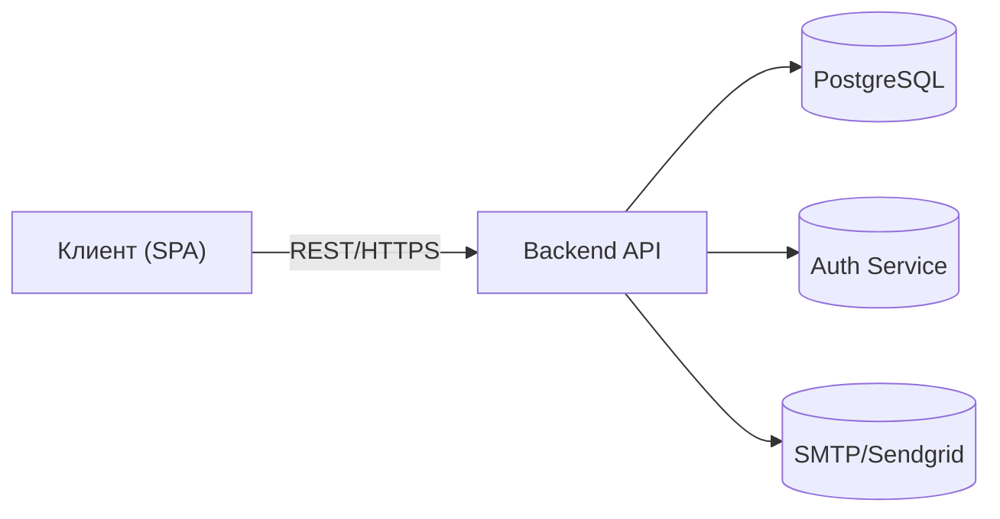

# C4-L1 — System Context

## Система бронирования услуг

```mermaid
graph LR
  Client["Клиент (SPA)"] -->|REST/HTTPS| API["Backend API"]
  API --> DB[(PostgreSQL)]
  API --> Auth[(Auth Service)]
  API --> Mail[(SMTP/Sendgrid)]
``` 