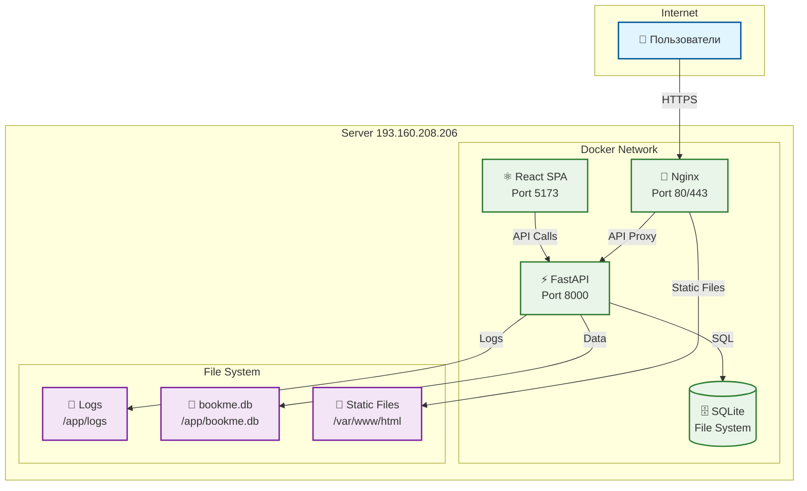

# Инфраструктура DeDato

## Обзор

DeDato развернута на выделенном сервере с использованием Docker контейнеров. Инфраструктура спроектирована для обеспечения высокой доступности, производительности и простоты масштабирования.

## Текущая инфраструктура

### Сервер
- **IP адрес:** 193.160.208.206
- **ОС:** Ubuntu 20.04 LTS
- **CPU:** 4 ядра
- **RAM:** 8 GB
- **Диск:** 100 GB SSD
- **Провайдер:** VPS

### Сетевая конфигурация


## Порты и сервисы

### Открытые порты
| Порт | Протокол | Сервис | Описание |
|------|----------|--------|----------|
| 80 | HTTP | Nginx | Основной HTTP порт |
| 443 | HTTPS | Nginx | SSL/TLS (планируется) |
| 22 | SSH | OpenSSH | Удаленное управление |

### Внутренние порты
| Порт | Сервис | Описание |
|------|--------|----------|
| 8000 | FastAPI Backend | API сервер |
| 5173 | React Dev Server | Frontend (development) |
| 3000 | React Build | Frontend (production) |

## Docker конфигурация

### Docker Compose (Production)
```yaml
# docker-compose.prod.yml
version: '3.8'

services:
  backend:
    build:
      context: ./backend
      dockerfile: Dockerfile
    container_name: dedato-backend
    ports:
      - "8000:8000"
    volumes:
      - ./backend/bookme.db:/app/bookme.db
      - ./logs:/app/logs
    environment:
      - SECRET_KEY=${SECRET_KEY}
      - DATABASE_URL=sqlite:///./bookme.db
    restart: unless-stopped
    networks:
      - dedato-network

  frontend:
    build:
      context: ./frontend
      dockerfile: Dockerfile.prod
    container_name: dedato-frontend
    ports:
      - "3000:80"
    volumes:
      - ./frontend/dist:/usr/share/nginx/html
    restart: unless-stopped
    networks:
      - dedato-network

  nginx:
    image: nginx:alpine
    container_name: dedato-nginx
    ports:
      - "80:80"
      - "443:443"
    volumes:
      - ./nginx.conf:/etc/nginx/nginx.conf
      - ./frontend/dist:/var/www/html
      - ./ssl:/etc/nginx/ssl
    depends_on:
      - backend
      - frontend
    restart: unless-stopped
    networks:
      - dedato-network

networks:
  dedato-network:
    driver: bridge

volumes:
  logs:
  database:
```

### Docker Compose (Development)
```yaml
# docker-compose.yml
version: '3.8'

services:
  backend:
    build:
      context: ./backend
      dockerfile: Dockerfile
    container_name: dedato-backend-dev
    ports:
      - "8000:8000"
    volumes:
      - ./backend:/app
      - ./backend/bookme.db:/app/bookme.db
    environment:
      - SECRET_KEY=dev-secret-key
      - DATABASE_URL=sqlite:///./bookme.db
    command: uvicorn main:app --host 0.0.0.0 --port 8000 --reload
    networks:
      - dedato-network

  frontend:
    build:
      context: ./frontend
      dockerfile: Dockerfile
    container_name: dedato-frontend-dev
    ports:
      - "5173:5173"
    volumes:
      - ./frontend:/app
      - /app/node_modules
    environment:
      - VITE_API_URL=http://localhost:8000/api/v1
    command: npm run dev
    networks:
      - dedato-network

networks:
  dedato-network:
    driver: bridge
```

## Nginx конфигурация

### Основная конфигурация
```nginx
# nginx.conf
user nginx;
worker_processes auto;
error_log /var/log/nginx/error.log;
pid /run/nginx.pid;

events {
    worker_connections 1024;
    use epoll;
    multi_accept on;
}

http {
    include /etc/nginx/mime.types;
    default_type application/octet-stream;
    
    # Logging
    log_format main '$remote_addr - $remote_user [$time_local] "$request" '
                    '$status $body_bytes_sent "$http_referer" '
                    '"$http_user_agent" "$http_x_forwarded_for"';
    
    access_log /var/log/nginx/access.log main;
    
    # Performance
    sendfile on;
    tcp_nopush on;
    tcp_nodelay on;
    keepalive_timeout 65;
    types_hash_max_size 2048;
    
    # Gzip compression
    gzip on;
    gzip_vary on;
    gzip_min_length 1024;
    gzip_types text/plain text/css application/json application/javascript text/xml application/xml application/xml+rss text/javascript;
    
    # Rate limiting
    limit_req_zone $binary_remote_addr zone=api:10m rate=10r/s;
    limit_req_zone $binary_remote_addr zone=auth:10m rate=5r/m;
    
    # Upstream backend
    upstream backend {
        server backend:8000;
    }
    
    server {
        listen 80;
        server_name 193.160.208.206 dedato.com www.dedato.com;
        
        # Security headers
        add_header X-Frame-Options DENY;
        add_header X-Content-Type-Options nosniff;
        add_header X-XSS-Protection "1; mode=block";
        add_header Referrer-Policy "strict-origin-when-cross-origin";
        
        # Static files
        location / {
            root /var/www/html;
            index index.html;
            try_files $uri $uri/ /index.html;
            
            # Cache static assets
            location ~* \.(js|css|png|jpg|jpeg|gif|ico|svg)$ {
                expires 1y;
                add_header Cache-Control "public, immutable";
            }
        }
        
        # API proxy
        location /api/ {
            limit_req zone=api burst=20 nodelay;
            
            proxy_pass http://backend;
            proxy_set_header Host $host;
            proxy_set_header X-Real-IP $remote_addr;
            proxy_set_header X-Forwarded-For $proxy_add_x_forwarded_for;
            proxy_set_header X-Forwarded-Proto $scheme;
            
            # Timeouts
            proxy_connect_timeout 30s;
            proxy_send_timeout 30s;
            proxy_read_timeout 30s;
        }
        
        # Auth endpoints with stricter rate limiting
        location /api/auth/ {
            limit_req zone=auth burst=5 nodelay;
            
            proxy_pass http://backend;
            proxy_set_header Host $host;
            proxy_set_header X-Real-IP $remote_addr;
            proxy_set_header X-Forwarded-For $proxy_add_x_forwarded_for;
            proxy_set_header X-Forwarded-Proto $scheme;
        }
        
        # Health check
        location /health {
            access_log off;
            return 200 "healthy\n";
            add_header Content-Type text/plain;
        }
    }
}
```

## Мониторинг и логирование

### Логирование
```bash
# Структура логов
/app/logs/
├── nginx/
│   ├── access.log
│   └── error.log
├── backend/
│   ├── app.log
│   ├── error.log
│   └── access.log
└── system/
    ├── syslog
    └── auth.log
```

### Ротация логов
```bash
# /etc/logrotate.d/dedato
/app/logs/*.log {
    daily
    missingok
    rotate 30
    compress
    delaycompress
    notifempty
    create 644 root root
    postrotate
        docker exec dedato-nginx nginx -s reload
    endscript
}
```

### Мониторинг системы
```bash
# Основные метрики
- CPU usage: < 70%
- Memory usage: < 80%
- Disk usage: < 85%
- Network I/O
- Docker container health
```

## Безопасность

### Firewall (UFW)
```bash
# Настройка UFW
sudo ufw default deny incoming
sudo ufw default allow outgoing
sudo ufw allow ssh
sudo ufw allow 80/tcp
sudo ufw allow 443/tcp
sudo ufw enable
```

### SSL/TLS (планируется)
```bash
# Let's Encrypt сертификат
certbot --nginx -d dedato.com -d www.dedato.com
```

### Docker Security
```bash
# Запуск контейнеров без root
docker run --user 1000:1000 dedato-backend

# Ограничение ресурсов
docker run --memory=512m --cpus=1 dedato-backend
```

## Backup стратегия

### Автоматический backup
```bash
#!/bin/bash
# backup.sh

DATE=$(date +%Y%m%d_%H%M%S)
BACKUP_DIR="/backups"
DB_FILE="/app/bookme.db"

# Создание backup директории
mkdir -p $BACKUP_DIR

# Backup базы данных
cp $DB_FILE $BACKUP_DIR/bookme_backup_$DATE.db

# Backup логов
tar -czf $BACKUP_DIR/logs_backup_$DATE.tar.gz /app/logs/

# Backup конфигурации
tar -czf $BACKUP_DIR/config_backup_$DATE.tar.gz /etc/nginx/ /docker-compose*.yml

# Удаление старых backup'ов (старше 30 дней)
find $BACKUP_DIR -name "*.db" -mtime +30 -delete
find $BACKUP_DIR -name "*.tar.gz" -mtime +30 -delete

echo "Backup completed: $DATE"
```

### Cron задача
```bash
# /etc/crontab
0 2 * * * root /app/scripts/backup.sh >> /var/log/backup.log 2>&1
```

## Масштабирование

### Горизонтальное масштабирование
```yaml
# docker-compose.scale.yml
version: '3.8'

services:
  backend:
    deploy:
      replicas: 3
    environment:
      - REDIS_URL=redis://redis:6379
    depends_on:
      - redis

  redis:
    image: redis:alpine
    container_name: dedato-redis
    ports:
      - "6379:6379"
    volumes:
      - redis_data:/data

  nginx:
    # Load balancer конфигурация
    volumes:
      - ./nginx-lb.conf:/etc/nginx/nginx.conf

volumes:
  redis_data:
```

### Вертикальное масштабирование
```bash
# Увеличение ресурсов сервера
- CPU: 4 → 8 ядер
- RAM: 8GB → 16GB
- Disk: 100GB → 200GB SSD
```

## Disaster Recovery

### План восстановления
1. **Остановка сервисов**
   ```bash
   docker-compose -f docker-compose.prod.yml down
   ```

2. **Восстановление из backup**
   ```bash
   cp /backups/bookme_backup_latest.db /app/bookme.db
   ```

3. **Запуск сервисов**
   ```bash
   docker-compose -f docker-compose.prod.yml up -d
   ```

4. **Проверка работоспособности**
   ```bash
   curl http://localhost/health
   ```

### RTO/RPO цели
- **RTO (Recovery Time Objective):** 4 часа
- **RPO (Recovery Point Objective):** 24 часа
- **Availability:** 99.5%

## Планы развития инфраструктуры

### Phase 1: High Availability
- Load balancer (HAProxy/Nginx)
- Database replication (PostgreSQL)
- Multiple app servers
- CDN для статических файлов

### Phase 2: Container Orchestration
- Kubernetes cluster
- Auto-scaling
- Service mesh (Istio)
- Monitoring (Prometheus/Grafana)

### Phase 3: Multi-region
- Multiple data centers
- Global load balancing
- Cross-region replication
- Edge computing

## Связанные документы

- Docker / compose / CI на проде: корневые `PROD_DEPLOY.md`, `docker-compose.prod.yml` (вне этого MkDocs-сайта).
- [ADR-0002: Выбор базы данных](../adr/0002-database-choice.md)
- [C4 Model: Container](../c4/02-container.md)


